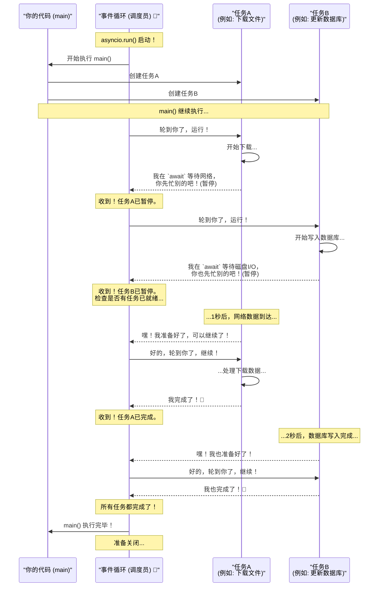

+++
date = '2025-11-04T10:00:00+08:00'
draft = false
title = 'AngelFlow(初版)'
+++
介绍AngelFlow初版，后续将废弃⚠️ 

<!--more-->

# controller
有几个接口+定时器，现在要改的是定时器，就是之前将直接变Failed的地方，判断下超时，只有超时的才执行

ProcessTask：
- 先将running,releasing,suspending,suspended的任务全都捞出来，然后获取服务proxy，然后进行处理
- 再遍历任务列表，对于作业正在停止中 (Releasing)的和作业正在暂停中 (Suspending)， 查询该 Job 下是否还有未终结的 Task（状态为 Canceling, Running, Wait 的任务数）。
  如果未终结的任务数 <= 0（说明所有子任务都已结束），则调用 StopJob 将作业状态更新为 已停止。
  如果未终结的任务数 <= 0（说明所有子任务都已暂停或结束），则调用 MarkJobSuspended 将作业状态更新为 已暂停。
  优雅退出机制：代码没有直接强制把 Job 设为停止，而是先检查 Task 数量。这说明这是一个异步的优雅停止/暂停机制，必须等所有子任务处理完（或取消完）后，Job 才会正式结束。
  并发安全：状态检查部分放在 go func 中执行，提高了主循环的处理速度，避免因为数据库 Count 操作阻塞主流程
- DealJob 的作用是：在分布式锁的保护下，对单个 Job 包含的 Task 进行“清理关闭 -> 维护运行 -> 启动新任务”的流水线处理，并控制处理节奏以减轻系统负载。


```go
		if time.Now().UnixMilli()-findTask.UpdatedAt > model.GetTaskDealTimeIntervalConfig(ctx) {
			log.InfoContextf(ctx, "close task fail but beyond time window")
			err = task.DefaultTaskDbManager.UpdateTaskStatusToFinalDirect(ctx, taskId, model.StatusFailed, "close task fail")
			return err
		}
		log.InfoContextf(ctx, "close task fail but within time window")

```


asyncio.run() 是 Python 3.7 版本引入的一个高级函数，它是 启动和运行一个顶层 async 函数（协程）的最简单、最推荐的方式。

asyncio.run() 到底做了什么？
- 当你调用 asyncio.run(main()) 时，它在幕后帮你处理了一系列繁琐但必要的操作：
- 创建事件循环 (Event Loop)：它会创建一个全新的 asyncio 事件循环。事件循环是 asyncio 的核心，负责调度和执行所有的异步任务。
- 设置为主循环：将这个新创建的循环设置为当前线程的主事件循环。
- 运行你的协程：它把你传入的协程（例如 main()）提交给事件循环去执行。
- 管理所有任务：它会一直运行，直到你传入的协程以及由它创建的所有其他异步任务（例如用 asyncio.create_task() 创建的任务）全部执行完毕。
- 关闭事件循环：在所有任务完成后，它会优雅地关闭事件循环，释放所有相关资源。
- 返回结果：如果你的 async 函数有返回值，asyncio.run() 会将这个返回值交给你。
- 简单来说，asyncio.run() 帮你自动化了整个异步程序的“启动 -> 运行 -> 清理”的生命周期管理。





# 压测脚本

query

run_single_task：
        start_task


1c报错：
1、Timeout waiting for input for 

    _run_single_task->
