+++
date = '2025-11-04T10:00:00+08:00'
draft = false
title = 'AngelFlow'
+++

asyncio.run() 是 Python 3.7 版本引入的一个高级函数，它是 启动和运行一个顶层 async 函数（协程）的最简单、最推荐的方式。

asyncio.run() 到底做了什么？
- 当你调用 asyncio.run(main()) 时，它在幕后帮你处理了一系列繁琐但必要的操作：
- 创建事件循环 (Event Loop)：它会创建一个全新的 asyncio 事件循环。事件循环是 asyncio 的核心，负责调度和执行所有的异步任务。
- 设置为主循环：将这个新创建的循环设置为当前线程的主事件循环。
- 运行你的协程：它把你传入的协程（例如 main()）提交给事件循环去执行。
- 管理所有任务：它会一直运行，直到你传入的协程以及由它创建的所有其他异步任务（例如用 asyncio.create_task() 创建的任务）全部执行完毕。
- 关闭事件循环：在所有任务完成后，它会优雅地关闭事件循环，释放所有相关资源。
- 返回结果：如果你的 async 函数有返回值，asyncio.run() 会将这个返回值交给你。
- 简单来说，asyncio.run() 帮你自动化了整个异步程序的“启动 -> 运行 -> 清理”的生命周期管理。

```mermaid
sequenceDiagram
    participant YourCode as "你的代码 (main)"
    participant EventLoop as "事件循环 (调度员) 👷"
    participant TaskA as "任务A<br>(例如: 下载文件)"
    participant TaskB as "任务B<br>(例如: 更新数据库)"

    Note over EventLoop: asyncio.run() 启动！
    EventLoop->>YourCode: 开始执行 main()

    YourCode->>TaskA: 创建任务A
    YourCode->>TaskB: 创建任务B
    
    Note over YourCode, TaskB: main() 继续执行...

    EventLoop->>TaskA: 轮到你了，运行！
    TaskA->>TaskA: 开始下载...
    TaskA-->>EventLoop: 我在 `await` 等待网络，<br>你先忙别的吧！(暂停)

    Note over EventLoop: 收到！任务A已暂停。

    EventLoop->>TaskB: 轮到你了，运行！
    TaskB->>TaskB: 开始写入数据库...
    TaskB-->>EventLoop: 我在 `await` 等待磁盘I/O，<br>你也先忙别的吧！(暂停)

    Note over EventLoop: 收到！任务B已暂停。<br>检查是否有任务已就绪...

    Note over TaskA: ...1秒后，网络数据到达...
    TaskA-->>EventLoop: 嘿！我准备好了，可以继续了！

    EventLoop->>TaskA: 好的，轮到你了，继续！
    TaskA->>TaskA: ...处理下载数据...
    TaskA-->>EventLoop: 我完成了！🎉

    Note over EventLoop: 收到！任务A已完成。
    
    Note over TaskB: ...2秒后，数据库写入完成...
    TaskB-->>EventLoop: 嘿！我也准备好了！

    EventLoop->>TaskB: 好的，轮到你了，继续！
    TaskB-->>EventLoop: 我也完成了！🎉

    Note over EventLoop: 所有任务都完成了！
    EventLoop->>YourCode: main() 执行完毕！
    Note over EventLoop: 准备关闭...

```

# 压测脚本

query

run_single_task：
        start_task

1c报错：
1、Timeout waiting for input for 

    _run_single_task->
