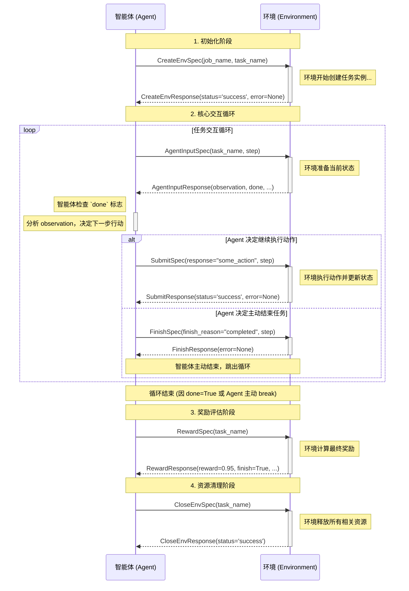
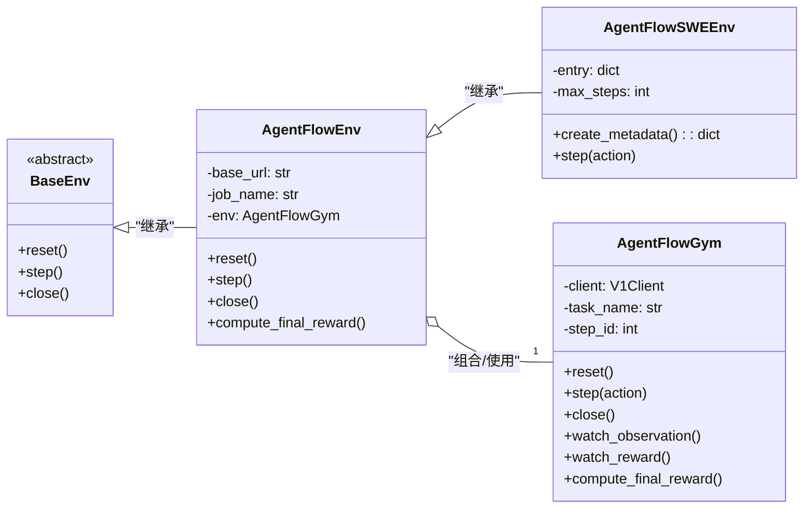
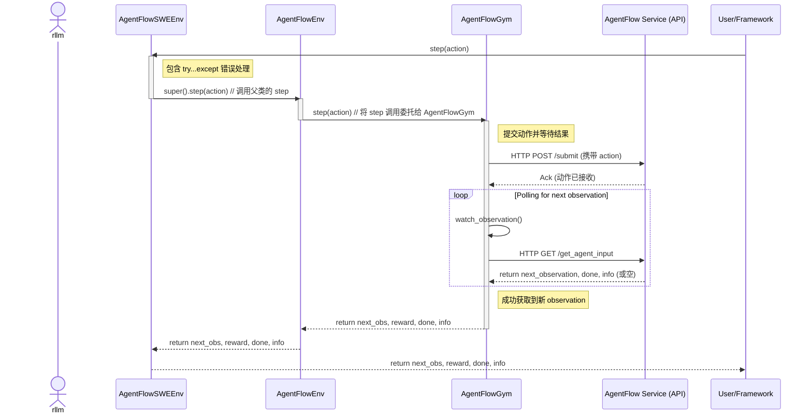

+++
date = '2025-11-04T10:00:00+08:00'
draft = false
title = 'AngelAgent'
+++

feature/angentflow-deepswe 分支

<!--more-->

使用了openai gym的标准env环境接口，对接我们的内部接口，现在需要找到具体怎么用的

资源相关：
https://git.woa.com/AngelAGI/AngelAgent/tree/feature/angentflow-deepswe/scripts/agentflow

分为3个步骤：
- 申请资源
- 启动job
- 启动task

# 智能体和环境交互
## 接口
- CreateEnv
- AgentInput
- Submit
- Finish
- Reward
- CloseEnv

## 时序图

