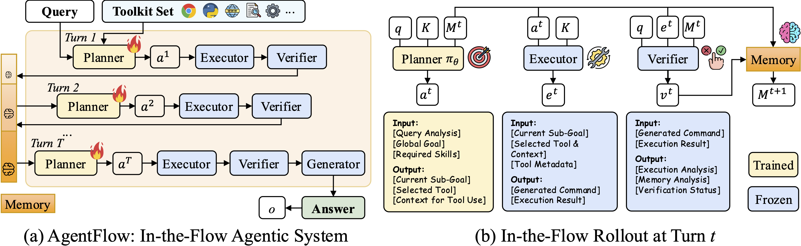

+++
date = '2025-10-27T15:00:00+08:00'
draft = true
title = 'AgentFlow'
+++
https://agentflow.stanford.edu/

<!--more-->

可以看图中的memory和4个模块的关系

图中的Memory简写为M，tookit简写为K,用户的输入given query 简写为q,在planner上有个小火苗表示自动优化，适应

# 是什么？
A trainable, in-the-flow agentic framework that coordinates four modules (planner, executor, verifier, generator) through an evolving memory and directly optimizes its planner inside the multi-turn loop
AgentFlow is a general-purpose tool-integrated agentic framework for solving complex reasoning tasks through fine-grained planning and effective tool use.

- 通用的集成工具的框架
- 为了解决复杂 问题
- 可训练、流程中的智能体框架
- 通过不断进化的memory协调4个模块(planner, executor, verifier, generator)
- 直接在多轮循环中优化planner

-- memory如何演化的？又是如何协调4个模块的？
    - 那肯定是将很多数据直接更新到一个库里吧？
    - 在流程上是在每一轮verifier后将结果加到memory中的
        - verifier产生二进制信号，如果Vt==0，怎记忆直接更新，这个直到Vt==1或达到最大轮次
    - 4个模块怎么使用这个memory的？
        - 从memory中召回相关的上下文 

--  如何直接优化planner的？
    - 

- 如何解决复杂问题的？
  - 通过多轮Markov Decision Process (MDP)，马尔可夫决策过程
- 什么是马尔可夫决策过程？
  - https://hrl.boyuai.com/chapter/1/%E9%A9%AC%E5%B0%94%E5%8F%AF%E5%A4%AB%E5%86%B3%E7%AD%96%E8%BF%87%E7%A8%8B

# 为什么？
# 怎么用？

# 