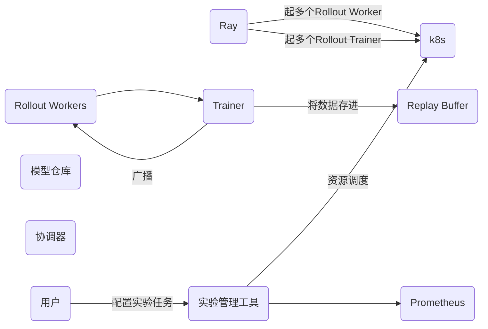
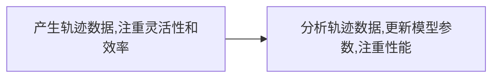
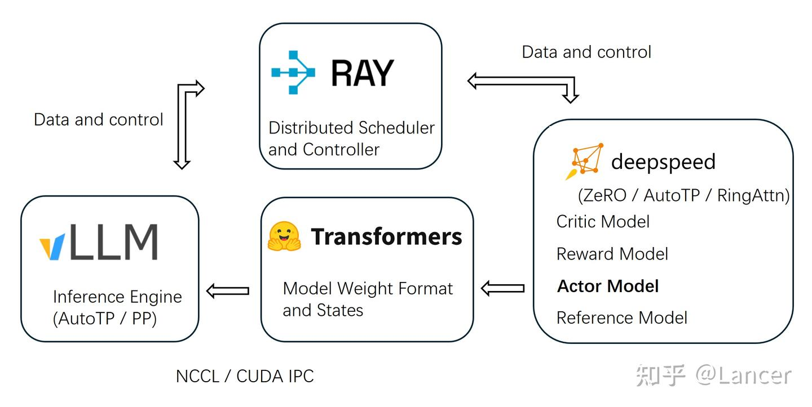

+++
date = '2025-10-27T10:00:00+08:00'
draft = false
title = 'RL infra概述'
+++

- 写给对RL感兴趣的技术/产品看，偏科普为主，后面可以深入的时候，可以结合算法痛点找出应该解决的问题
- 擅长调研，系列更新没问题
- 公众号/知乎/论文-->也许不够系统，或者不够通俗，没有实战
- 实战结合
- 对RL分为哪几个部分有个清晰的了解，对RL产生些兴趣

希望读者产生什么样的印象？
- 通俗好理解，一下子就知道这玩意的工作逻辑

哪些是共识区？

有哪些是读者知道的，作者不知道的？
- 可能会挑战的

<!--more-->

# RL
上一帧和下一帧有强连贯性，需要延迟奖励

强化学习是序列样本。监督学习样本是独立的

# RL&RL INFRA

RL(Reinforcement learning)，强化学习，属于机器学习中的一种，指agent在与环境交互过程中通过获得奖惩的方式进行学习。
那在训练模型的过程中，RL infra是不可获缺的

# RL infra的基本组成

## 作用

RL infra是指支持强化学习算法研究、训练、评估和部署的一整套系统、工具和流程

解决问题：
- 海量的数据交互：RL需要通过在环境中进行大量的rollout来收集数据
- 计算密集：训练(GPU上)和模拟(CPU上)都需要大量的计算资源
- 高度的迭代和实验性：RL调参非常困难，需要进行千百次时延来找到最佳配置
- 复杂的系统集成：模拟环境、策略模型、数据收集、训练等多个动态交互的组件

## 组成

1、计算与资源层
- CPU/GPU
- 资源调度与编排
- 云服务

2、数据与通信层
- 分布式数据流
  - 消息队列
  - 高性能网络：保证在rollout worker和trainer之间搞笑传输大量的轨迹数据
- 数据存储
  -对象存储
  - 高速缓存- 
3、 分布式执行与框架
- 核心分布式框架
  - Ray：提供简单二强大的API框架
  - Horovod/Deepseed:专注于数据并行的分布式框架，常与ray结合
4、环境与模拟层
- 标准环境接口
  - OPENAI GYM/Gymnasium :定义环境的标准接口(step/reset)等。
  - 模拟器

5、实验管理和运维

## 分布式RL工作流
- 启动试验
- 资源调度
- 任务分发(Ray)
  - 一个协调器 (Coordinator/Driver) 进程启动。
  - Ray 启动 N 个 Rollout Worker Actor（通常是 CPU 密集型），每个都在自己的环境中进行 rollout，收集经验数据。
  - Ray 启动一个或多个 Trainer Actor（通常是 GPU 密集型），负责从 Rollout Worker 那里接收数据。
- 数据收集与训练循环
  - Rollout Workers 使用最新的策略模型，在模拟器中运行，并将生成的轨迹数据发送给 Trainer
  - Trainer 将数据存入 Replay Buffer（如果是 Off-Policy）或直接用于梯度计算（如果是 On-Policy）
  - Trainer 在 GPU 上更新模型参数
  - Trainer 将更新后的模型权重广播给所有的 Rollout Workers
  - 循环往复。
- 监控与记录
  - 所有组件的性能指标（如每秒帧数 FPS、训练速度）被 Prometheus 收集，并通过 Grafana 可视化。
  - 训练过程中的奖励、loss 等指标被发送到 W&B 或 TensorBoard 进行实时展示。
- 完成与部署
  - 训练达到收敛标准后，最终的模型被保存到模型仓库。 
  - 通过 Ray Serve 等工具将模型部署为 API 服务，用于实际应用中的决策。

所以这里涉及的基础设施就是任务的分发和轨迹数据的收集

# 如何生成轨迹数据？
## 什么是轨迹数据？
轨迹是智能体（Agent）在与环境（Environment）进行一次完整或部分的互动过程中，所经历的一系列状态、动作和奖励的记录。
τ = (S₀, A₀, R₁, S₁, A₁, R₂, S₂, ..., Sₜ, Aₜ, Rₜ₊₁, Sₜ₊₁, ..., Sₙ)

*   **状态 (State, Sₜ)**：在时间点 `t` 时，环境的样子。例如，在游戏中是当前的游戏画面，在机器人控制中是机器人的关节角度和速度。
*   **动作 (Action, Aₜ)**：在状态 `Sₜ` 下，智能体选择执行的动作。例如，在游戏中是“向左走”，在机器人控制中是“给某个电机施加一个特定的力矩”。
*   **奖励 (Reward, Rₜ₊₁)**：在状态 `Sₜ` 下执行动作 `Aₜ` 后，环境给予的即时反馈。这个奖励是评估动作好坏的直接信号。注意下标是 `t+1`，表示这是在 `t` 时刻的动作导致的结果。
*   **下一个状态 (Next State, Sₜ₊₁)**：执行动作 `Aₜ` 后，环境在时间点 `t+1` 转移到的新状态。

举例：
一条完整的轨迹数据样例：
现在，假设智能体执行了一系列动作，完成了一局游戏（一个 Episode）。这条轨迹记录如下：
路径描述: 智能体从 (0,0) 开始，先向右，然后向下，不幸掉入了陷阱，游戏结束。
轨迹数据 (Trajectory τ):
τ = { (S₀, A₀, R₁, S₁), (S₁, A₁, R₂, S₂) }
下面是这条轨迹中每个时间步 (Timestep) 的详细数据：
  时间步 t = 0
  当前状态 (S₀): (0, 0) (智能体在起点)
  采取动作 (A₀): 向右 (Right)
  获得奖励 (R₁): -1 (走了一步的代价)
  进入下一状态 (S₁): (0, 1)
  是否结束 (Done): False (游戏还未结束)
这个时间步的数据可以表示为一个元组：((0, 0), 'Right', -1, (0, 1), False)
  时间步 t = 1
  当前状态 (S₁): (0, 1)
  采取动作 (A₁): 向下 (Down)
  获得奖励 (R₂): -10 (掉进了陷阱)
  进入下一状态 (S₂): (1, 1)
  是否结束 (Done): True (游戏结束)
这个时间步的数据可以表示为一个元组：((0, 1), 'Down', -10, (1, 1), True)

trajectory = [
# (state, action, reward, next_state, done)
( (0, 0), 'Right', -1, (0, 1), False ),
( (0, 1), 'Down',  -10, (1, 1), True  )
]

# 如何处理轨迹数据并优化模型参数的？

拿到轨迹数据后倒推，并为每步轨迹数据打分，然后送给模型去学习

# 业界框架

## TRL(Transformer Reinforcement learning)
什么是Transformer？
- Transformer 是一种神经网路架构，可将输入序列转换或变更为输出序列
### 算法支持
- SFT
- PPO
- DPO
- GRPO
- IPO
- KTO
- Online DPO
- REINFORCE++
### 集成
- transformers: 支持与vLLM的集成
### 训练后端
- accelerate库，支持DDP，deepseed zeRO,FSDP

### 特点

## OpenTRL

## veRL
## AReal

## NeMo-RL
## ROLL
## smile

# 附录

https://transformers.run/c1/transformer/

## 算法
好的，没问题！我们用一个更生活化的比喻来解释这一切。

想象一下，我们要**训练一个叫“小智”的 AI 学生写作文**。我们的目标是让他写的作文越来越好，不仅通顺，还要有思想、有礼貌。

---

### 第 1 步：基础教育

#### SFT (监督微调) - “背范文”
*   **方法**：我们找来几千篇顶级的范文（问题和标准答案），然后让小智一篇一篇地读，一篇一篇地背。
*   **指令**：“小智，看到这个题目，就要像这篇范文一样回答，懂了吗？”
*   **结果**：小智学会了写作的基本格式和套路。他现在能写出语法正确、内容相关的文章了，但可能有点死板，像个机器人。

---

### 第 2 步：进阶训练（老方法）

现在我们想让小智更有创造力，写的文章更好。

#### REINFORCE++ - “考完试再打总分”
*   **方法**：让小智独立完成一整篇作文。等他全部写完后，老师过来给他打一个总分，比如 85 分。
*   **学习方式**：
  *   如果分数高（85分），小智就觉得：“嗯，我这次写的整套思路都不错！” 于是他会强化这次写作的所有习惯。
  *   如果分数低（40分），小智就觉得：“天呐，我这次从头到尾都写砸了！” 于是他会避免这次的所有写作习惯。
*   **缺点**：太笼统了！可能作文里只有一句话写得不好，但整个作文都被打了低分，这会让小智感到困惑。

#### PPO (近端策略优化) - “请个私教，一句一句地指导”
*   **方法**：这是经典 RLHF 的核心。我们不打总分了，而是花钱请一个专业的“**裁判**”（也就是奖励模型）。这个裁判会盯着小智写作，**每写一句话，裁判就给这句话打个分**。
*   **学习方式**：
  *   小智写了一句：“月光如水。” 裁判：“好句！+2分！” 小智就学会了多用比喻。
  *   小智写了一句：“今天天气哈哈哈。” 裁判：“烂句！-5分！” 小智就学会了不要用废话。
*   **优点**：指导非常精细，小智进步飞快。
*   **PPO的精髓**：私教还会告诉小智：“虽然那句话不好，但你别一下子变得不敢写了。每次只做一点小小的调整，稳步前进。” 这就是“近端（Proximal）”的意思，防止他学跑偏。

---

### 第 3 步：进阶训练（新方法，更聪明！）

请私教（训练奖励模型）太贵太麻烦了。有没有更简单高效的方法呢？有！这就是 DPO 和它的朋友们。

#### DPO (直接偏好优化) - “二选一，哪个更好？”
*   **方法**：我们彻底放弃了打分制。现在，我们让小智针对一个题目，写出**两个版本**的答案（A 和 B）。然后我们拿给真人看，只问一个简单问题：“你更喜欢 A 还是 B？”
*   **学习方式**：真人只需要做选择题，比如选了 A。DPO 算法就能非常聪明地从这个简单的“A > B”的选择中，直接领悟到什么样的句子是“好”的，什么样的句子是“不好”的。
*   **优点**：
  1.  **对人类更友好**：做选择题比给文章打分容易多了。
  2.  **训练更直接**：它跳过了“训练一个裁判”的中间步骤，直接根据人类的偏好来优化自己，所以叫“直接偏好优化”。

#### DPO 的朋友们（都是基于“二选一”思想的改进）

*   **IPO** - **“别走火入魔”**
  *   **问题**：DPO 有时候太钻牛角尖，如果我们一直告诉他 A 比 B 好，他可能会认为 A 是神作，B 是垃圾，从而变得偏激。
  *   **IPO 的作用**：它会提醒小智：“我知道 A 更好，但你也别完全忘了你最初背过的范文（SFT模型）。保持谦虚，别过度自信。” 这样能让小智更稳重。

*   **KTO** - **“点赞和点踩就行”**
  *   **问题**：每次都让小智写两个版本再选，还是有点麻烦。
  *   **KTO 的作用**：它简化了流程。现在小智只需要写**一个版本**的答案，我们看了之后，直接给他**点个赞👍**（代表好）或者**点个踩👎**（代表坏）就行了。这对人类来说是最简单的反馈方式。

*   **GRPO** - **“给所有答案排个名”**
  *   **方法**：让小智针对一个题目写出四个版本的答案（A, B, C, D）。然后我们直接给它们排个名次，比如 B > D > A > C。
  *   **GRPO 的作用**：它可以从这个完整的排名中学习，比简单的“二选一”包含了更丰富的信息。

*   **Online DPO** - **“随堂测验，持续进步”**
  *   **方法**：以前的方法都是用一本固定的“错题集”来训练。Online DPO 则是让小智直接和真实用户聊天，**实时收集**用户的偏好（比如用户觉得哪句话回答得更好），然后**马上用这些新数据来更新自己**。
  *   **结果**：小智变成了一个能够不断从真实互动中学习的好学生，永远在进步。

### 总结一下

*   **SFT**：是打基础，靠背书。
*   **PPO**：是请私教，一句一句打分，很贵但很细。
*   **DPO**：是革命性的新方法，让 AI 从“二选一”中直接学习，又快又好。
*   **IPO, KTO, GRPO, Online DPO**：都是 DPO 的升级版或变种，让“二选一”这个方法变得更强大、更灵活、适用场景更广。

