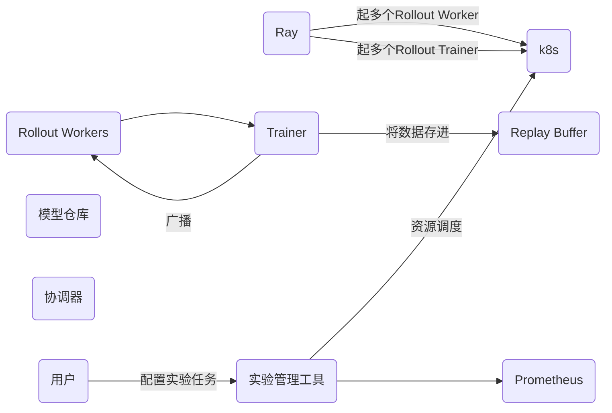
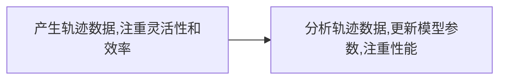

+++
date = '2025-10-27T10:00:00+08:00'
draft = false
title = 'RL infra概述'
+++

- 写给对RL感兴趣的技术/产品看，偏科普为主，后面可以深入的时候，可以结合算法痛点找出应该解决的问题
- 擅长调研，系列更新没问题
- 公众号/知乎/论文-->也许不够系统，或者不够通俗，没有实战
- 实战结合
- 对RL分为哪几个部分有个清晰的了解，对RL产生些兴趣

希望读者产生什么样的印象？
- 通俗好理解，一下子就知道这玩意的工作逻辑

哪些是共识区？

有哪些是读者知道的，作者不知道的？
- 可能会挑战的

<!--more-->

# RL
上一帧和下一帧有强连贯性，需要延迟奖励

强化学习是序列样本。监督学习样本是独立的

# RL&RL INFRA

RL(Reinforcement learning)，强化学习，属于机器学习中的一种，指agent在与环境交互过程中通过获得奖惩的方式进行学习。
那在训练模型的过程中，RL infra是不可获缺的

# RL infra的基本组成

## 作用

RL infra是指支持强化学习算法研究、训练、评估和部署的一整套系统、工具和流程

解决问题：
- 海量的数据交互：RL需要通过在环境中进行大量的rollout来收集数据
- 计算密集：训练(GPU上)和模拟(CPU上)都需要大量的计算资源
- 高度的迭代和实验性：RL调参非常困难，需要进行千百次时延来找到最佳配置
- 复杂的系统集成：模拟环境、策略模型、数据收集、训练等多个动态交互的组件

## 组成

1、计算与资源层
- CPU/GPU
- 资源调度与编排
- 云服务

2、数据与通信层
- 分布式数据流
  - 消息队列
  - 高性能网络：保证在rollout worker和trainer之间搞笑传输大量的轨迹数据
- 数据存储
  -对象存储
  - 高速缓存- 
3、 分布式执行与框架
- 核心分布式框架
  - Ray：提供简单二强大的API框架
  - Horovod/Deepseed:专注于数据并行的分布式框架，常与ray结合
4、环境与模拟层
- 标准环境接口
  - OPENAI GYM/Gymnasium :定义环境的标准接口(step/reset)等。
  - 模拟器

5、实验管理和运维

## 分布式RL工作流
- 启动试验
- 资源调度
- 任务分发(Ray)
  - 一个协调器 (Coordinator/Driver) 进程启动。
  - Ray 启动 N 个 Rollout Worker Actor（通常是 CPU 密集型），每个都在自己的环境中进行 rollout，收集经验数据。
  - Ray 启动一个或多个 Trainer Actor（通常是 GPU 密集型），负责从 Rollout Worker 那里接收数据。
- 数据收集与训练循环
  - Rollout Workers 使用最新的策略模型，在模拟器中运行，并将生成的轨迹数据发送给 Trainer
  - Trainer 将数据存入 Replay Buffer（如果是 Off-Policy）或直接用于梯度计算（如果是 On-Policy）
  - Trainer 在 GPU 上更新模型参数
  - Trainer 将更新后的模型权重广播给所有的 Rollout Workers
  - 循环往复。
- 监控与记录
  - 所有组件的性能指标（如每秒帧数 FPS、训练速度）被 Prometheus 收集，并通过 Grafana 可视化。
  - 训练过程中的奖励、loss 等指标被发送到 W&B 或 TensorBoard 进行实时展示。
- 完成与部署
  - 训练达到收敛标准后，最终的模型被保存到模型仓库。 
  - 通过 Ray Serve 等工具将模型部署为 API 服务，用于实际应用中的决策。

所以这里涉及的基础设施就是任务的分发和轨迹数据的收集

# 如何生成轨迹数据？
## 什么是轨迹数据？
轨迹是智能体（Agent）在与环境（Environment）进行一次完整或部分的互动过程中，所经历的一系列状态、动作和奖励的记录。
τ = (S₀, A₀, R₁, S₁, A₁, R₂, S₂, ..., Sₜ, Aₜ, Rₜ₊₁, Sₜ₊₁, ..., Sₙ)

*   **状态 (State, Sₜ)**：在时间点 `t` 时，环境的样子。例如，在游戏中是当前的游戏画面，在机器人控制中是机器人的关节角度和速度。
*   **动作 (Action, Aₜ)**：在状态 `Sₜ` 下，智能体选择执行的动作。例如，在游戏中是“向左走”，在机器人控制中是“给某个电机施加一个特定的力矩”。
*   **奖励 (Reward, Rₜ₊₁)**：在状态 `Sₜ` 下执行动作 `Aₜ` 后，环境给予的即时反馈。这个奖励是评估动作好坏的直接信号。注意下标是 `t+1`，表示这是在 `t` 时刻的动作导致的结果。
*   **下一个状态 (Next State, Sₜ₊₁)**：执行动作 `Aₜ` 后，环境在时间点 `t+1` 转移到的新状态。

# 如何处理轨迹数据并优化模型参数的？

拿到轨迹数据后倒推，并为每步轨迹数据打分，然后送给模型去学习

# 业界框架

## TRL(Transformer Reinforcement learning)
什么是Transformer？
- Transformer 是一种神经网路架构，可将输入序列转换或变更为输出序列
### 算法支持
- SFT
- PPO
- DPO
- GRPO
- IPO
- KTO
- Online DPO
- REINFORCE++
### 集成
- transformers: 支持与vLLM的集成
### 训练后端
- accelerate库，支持DDP，deepseed zeRO,FSDP

### 特点

## OpenTRL

## veRL
## AReal

## NeMo-RL
## ROLL
## smile

# 附录

https://transformers.run/c1/transformer/

