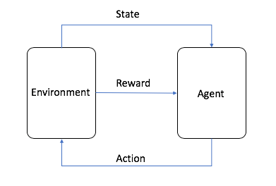

+++
date = '2025-11-03T15:00:00+08:00'
draft = true
title = 'GYM'
+++


https://github.com/openai/gym#
<!--more-->

OpenAI Gym 本身不是一个强化学习算法，而是一个工具包（Toolkit）。
核心概念：强化学习的交互循环

它的核心作用是提供各种各样标准化的环境（Environment），让研究人员和开发者可以专注于设计和测试他们的 AI 算法（智能体），而不用每次都从头搭建一个模拟世界。


安装gym包

`pip install gym`

使用：
```python
import gym
env = gym.make("CartPole-v1")
observation, info = env.reset(seed=42)

for _ in range(1000):
    action = env.action_space.sample()
    observation, reward, terminated, truncated, info = env.step(action)

    if terminated or truncated:
        observation, info = env.reset()
env.close()
```

环境告诉智能体当前状态是什么。
智能体根据这个状态，决定要采取一个动作。
智能体将动作告诉环境。
环境执行这个动作，然后更新自己，并返回给智能体两样东西：
一个新的状态。
一个奖励。
这个循环不断重复，直到任务完成或失败。

Env 类是一个抽象基类，定义了强化学习环境的核心接口。
子类必须实现 step 、 reset 和 render 方法。
其他方法（如 close 和 unwrapped ）提供了额外的功能支持。
通过 np_random 属性管理随机性，确保实验的可重复性。

1、step :
功能：执行环境的一个时间步动态。
参数： action （动作）。
返回值： (observation, reward, terminated, truncated, info) 。
2、reset :
功能：重置环境到初始状态。
参数： seed （可选种子）和 options （可选配置）。
返回值： (observation, info) 。
3、render :
功能：根据 render_mode 渲染环境。
返回值：取决于 render_mode ，可能是 None 、 rgb_array 或 ansi 格式的渲染结果。
4、close :
功能：关闭环境，执行必要的清理操作。
5、unwrapped （属性）:
功能：返回非包装的基础环境实例。
6、np_random （属性）:
功能：获取或设置环境的随机数生成器。
7、__str__ :
功能：返回环境的字符串表示形式。


```python
import gym
from gym import spaces
import numpy as np

class CustomEnv(gym.Env):
    def __init__(self):
        self.action_space = spaces.Discrete(2)  # 动作空间：2个离散动作
        self.observation_space = spaces.Box(low=0, high=1, shape=(1,))  # 状态空间：[0, 1]区间

    def step(self, action):
        # 必须实现：执行动作并返回结果
        observation = np.random.random(1)
        reward = 1.0 if action == 0 else -1.0
        terminated = False
        truncated = False
        info = {}
        return observation, reward, terminated, truncated, info

    def reset(self, seed=None, options=None):
        # 必须实现：重置环境
        super().reset(seed=seed)  # 调用基类方法初始化随机数生成器
        observation = np.random.random(1)
        info = {}
        return observation, info

    def render(self):
        # 必须实现：渲染逻辑（此处简单打印）
        print("Rendering environment...")

# 使用自定义环境
env = CustomEnv()
obs, info = env.reset()
print("Initial observation:", obs)
```

用例图


Gymnasium API 标准的自定义环境 Env


https://gymnasium.farama.org/introduction/create_custom_env/


一、必须实现的函数和属性

1. __init__(self, ...) (构造函数)

这是环境的入口。在构造函数中，你除了初始化环境的内部状态（如智能体位置、目标等）之外，必须定义以下两个属性：

self.action_space: 这个属性定义了智能体所有可能的“动作”。它必须是 gymnasium.spaces 模块中的一个实例，例如：

spaces.Discrete(n): 代表有 n 个离散的动作（例如，0, 1, 2, ..., n-1）。

spaces.Box(low, high, shape, dtype): 代表一个连续的动作空间，每个动作都是一个在 [low, high] 范围内的、形状为 shape 的向量。

self.observation_space: 这个属性定义了环境“观测”的结构、范围和类型。它也必须是 gymnasium.spaces 中的一个实例，例如：

spaces.Discrete(n): 观测是一个从 0 到 n-1 的整数。

spaces.Box(low, high, shape, dtype): 观测是一个向量或矩阵（例如，机器人关节角度、游戏画面的像素值）。

2. reset(self, *, seed=None, options=None)

这个函数在一个回合（episode）开始时被调用，用于将环境重置到初始状态。

功能:

重置环境的内部状态（例如，将智能体放回起点）。

处理随机种子（seed），以保证实验的可复现性。强烈建议在函数第一行调用 super().reset(seed=seed) 来正确处理随机数生成器。

参数:

seed (可选): 用于初始化环境的随机数生成器。

options (可选): 一个字典，用于传递额外的重置选项。

返回值: 必须返回一个包含两项的元组 (observation, info)。

observation: 环境的初始观测，必须符合 self.observation_space 的定义。

info: 一个包含辅助诊断信息的字典，通常在重置时可以是一个空字典 {}。

3. step(self, action)

这是环境的核心，驱动环境从一个时间步前进到下一个时间步。

功能:

接收智能体执行的 action。

根据 action 更新环境的内部状态。

计算这个动作带来的 reward。

判断回合是否结束 (terminated 或 truncated)。

生成新的 observation。

参数:

action: 智能体选择的动作，必须是 self.action_space 中的一个有效值。

返回值: 必须返回一个包含五项的元组 (observation, reward, terminated, truncated, info)。

observation: 执行动作后的新观测。

reward (float): 对上一个动作的奖励。

terminated (bool): True 表示任务自然结束（例如，成功到达终点或失败）。

truncated (bool): True 表示任务被人为截断（例如，达到了最大步数限制）。

info (dict): 包含辅助诊断信息的字典。


二、强烈推荐实现的函数

虽然以下函数不是强制性的，但为了创建一个功能完整的环境，你应该实现它们：

4. render(self)

用于将环境的状态可视化。

功能: 根据在 __init__ 中设置的 render_mode（例如 'human', 'rgb_array', 'ansi'）来展示环境。

'human': 弹出窗口进行实时渲染。

'rgb_array': 返回一个 NumPy 数组表示的图像帧。

'ansi': 返回一个字符串用于在终端打印。

返回值: 根据 render_mode 不同而不同。

5. close(self)

用于在环境使用完毕后清理和释放资源。

功能: 关闭所有在 render() 中打开的窗口、文件句柄或其他资源。


三、一个最简化的自定义环境示例

下面是一个简单的“向左走”环境，清晰地展示了所有必须实现的组件。目标是让智能体从位置 0 走到位置 -10。

import gymnasium as gym
from gymnasium import spaces
import numpy as np

class GoLeftEnv(gym.Env):
"""一个简单的自定义环境，目标是向左移动到终点。"""

    # 推荐添加 metadata，尤其是在需要渲染时
    metadata = {"render_modes": ["ansi"]}

    def __init__(self):
        super().__init__()
        
        # 1. 定义动作空间和观测空间 (必须)
        # 动作: 0 (向左), 1 (向右)
        self.action_space = spaces.Discrete(2)
        # 观测: 智能体的当前位置 (一个浮点数)
        self.observation_space = spaces.Box(low=-np.inf, high=np.inf, shape=(1,), dtype=np.float32)

        # 定义环境参数
        self.start_pos = 0.0
        self.goal_pos = -10.0
        self.max_steps = 50
        
        # 初始化内部状态
        self.current_pos = self.start_pos
        self.current_step = 0
        
    def reset(self, seed=None, options=None):
        # 重置随机数生成器 (好习惯)
        super().reset(seed=seed)

        # 2. 重置环境状态 (必须)
        self.current_pos = self.start_pos
        self.current_step = 0
        
        # 准备初始观测和信息
        observation = np.array([self.current_pos], dtype=np.float32)
        info = {} # 初始 info 为空
        
        # 必须返回 observation 和 info
        return observation, info

    def step(self, action):
        # 3. 实现 step 逻辑 (必须)
        if action == 0: # 向左
            self.current_pos -= 1.0
        elif action == 1: # 向右
            self.current_pos += 1.0
        
        self.current_step += 1
        
        # 判断是否结束
        terminated = self.current_pos <= self.goal_pos
        truncated = self.current_step >= self.max_steps
        
        # 计算奖励
        if terminated:
            reward = 100.0 # 到达终点给予高奖励
        else:
            reward = -1.0 # 每走一步给予负奖励，鼓励尽快到达
            
        # 准备返回信息
        observation = np.array([self.current_pos], dtype=np.float32)
        info = {}

        # 必须按顺序返回这 5 个值
        return observation, reward, terminated, truncated, info

    def render(self):
        # 4. 实现渲染 (推荐)
        # 这里使用 'ansi' 模式，直接打印到控制台
        print(f"当前步数: {self.current_step}, 当前位置: {self.current_pos:.1f}")

    def close(self):
        # 5. 实现清理 (推荐)
        # 这个简单环境不需要清理，但保留函数是个好习惯
        pass

# --- 使用和验证环境 ---
from gymnasium.utils.env_checker import check_env

# 验证环境是否符合 Gymnasium API
my_env = GoLeftEnv()
check_env(my_env)
print("环境验证通过！")

# 运行一个简单的回合
obs, info = my_env.reset()
my_env.render()
done = False
while not done:
action = my_env.action_space.sample() # 随机选择一个动作
obs, reward, terminated, truncated, info = my_env.step(action)
done = terminated or truncated
my_env.render()

my_env.close()


## Job

资源相关：
https://git.woa.com/AngelAGI/AngelAgent/tree/feature/angentflow-deepswe/scripts/agentflow
三个bash脚本，通过命令行使用

