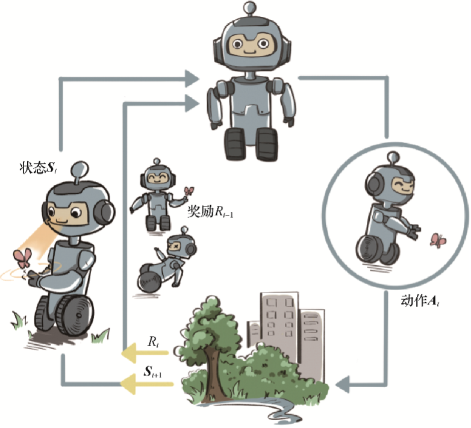
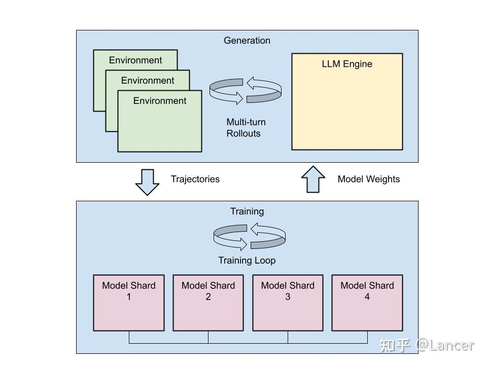

+++
date = '2025-11-06T10:00:00+08:00'
draft = false
title = 'RL infra'
+++

<!--more-->

强化学习最基础的概念就是 智能体与环境交互，然后得到奖励，并且要使得到的奖励最大化的过程

每次训练都可以得到一条轨迹：
- 环境状态
- 行动
- 奖励

在code场景中，会做多次尝试8次

# 那么RL infra是什么?
- 生成器：生成轨迹
- 训练器：利用轨迹优化模型参数

# 问题
- 如何生成轨迹？
  - 
- 如何训练模型？

# partial rollout
与其相对应的是我们传统意义上完整rollout，也成为full rollout
两者的区别可以用以下表格展示出来：

| 特性 | Full Rollout (完全展开)                                                 | Partial Rollout (部分展开) |
| :--- |:--------------------------------------------------------------------| :--- |
| **模拟深度** | 直到游戏结束（终止状态）                                                        | 有限的 `k` 步 |
| **价值估计来源** | 游戏最终的真实结果（如胜/负/平）                                                   | `k` 步的真实奖励 + 对最终状态的价值函数估计 `V(s')` |
| **优点** | 无偏估计（Unbiased），因为它使用的是真实结局。                                         | 1. **计算效率高**，速度快。 2. **方差更低**，价值估计更稳定。 |
| **缺点** | 1. **计算成本高**，耗时。 2. **方差极大**，尤其是在早期随机模拟时。 **3.由于问题不同，长尾现象明显** | **有偏估计 (Biased)**，其准确性严重依赖于价值函数的质量。如果价值函数很差，估计就会错得离谱。 |
| **典型应用** | 传统棋类（如象棋）的早期 MCTS 算法。                                               | **AlphaGo**、**AlphaZero**、Model-Based RL 中的规划算法。 |

