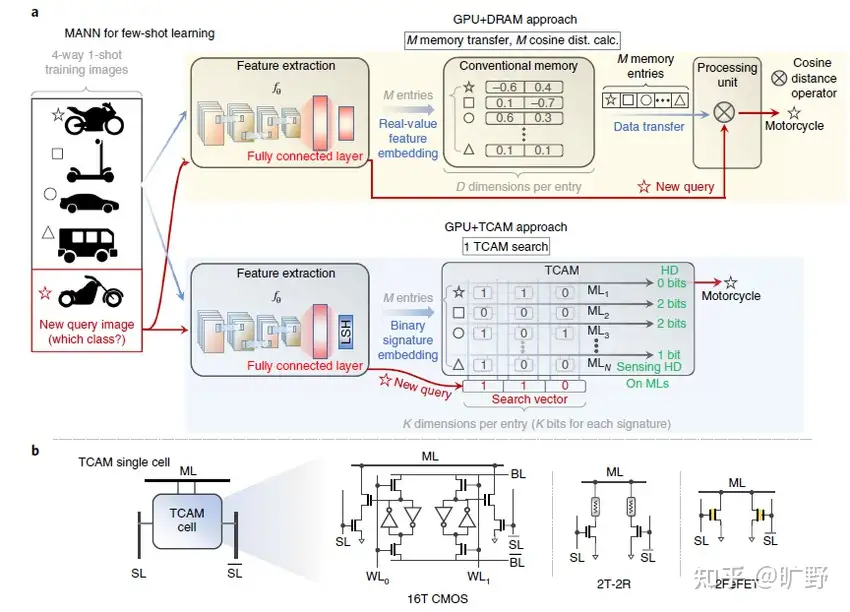

+++
date = '2025-11-07T10:00:00+08:00'
draft = false
title = 'RL 行业宏观调研'
+++

<!--more-->

- 行业历史发展路径
- 业界做了什么
- 分层分类
- 遇到了什么难题
- 有哪些是我们能做，机平做不了的？

# 名词解释
强化学习agent，而非大语言模型agent智能体
"奖励劫持"：奖励信号被模型利用
泛化性：一个模型在未见过的新数据上表现良好的能力，是衡量机器学习模型好坏的核心指标之一

策略层面，最重要的是学习算法，强化学习算法指导如何更新模型参数
环境层面，最重要是奖励函数，即如何对一个问题给予正确的奖励，让模型能学到真正有价值的内容。

# 发展路径

强化学习是机器学习研究领域的一种方式。Deepmind的AlphaGo后开始被人广泛关注。
AI软硬件提升，价值开始显现

强化学习最早是20世纪60年待，是为了模仿人脑的工作方式来设计计算机算法

来源：心理学的动物学习和最优控制的优化理论

人工智能：模仿人类大脑和动物学习的过程建立模型

试错学习-时间差分：借鉴了食物/疼痛给动物带来的刺激-Q-Learning基础工作之一
最优控制：控制器以最小化动态系统随时间推移行为的衡量标准问题- 贝尔曼方程，动态规划、马尔可夫决策霍城

# 训练方法
大模型三个不同阶段的训练方法：❶预训练（Pre-training）❷后训练（Post-training）❸微调（Fine-tuning）
预训练就是用大量的通用数据集先训练模型，让它掌握基础知识和技能。数据规模庞大，训练成本高，周期长（数万GPU天）

后训练是指在预训练完成后的进一步训练阶段，目的在于让模型更好地适应实际的特定任务或应用场景。
数据规模小，通常是特定领域的数据（专业基础课和专业课），训练周期短
后训练使用强化学习

做预训练的公司越来越少

微调：
- 属于后训练的一种，但模型在使用者那里（客户场景）

模型分为 训练和推理：
未来主要都在后训练/微调+推理
## 预训练
设计和实现新的预训练任务，如BERT、GPT等。
处理和清洗大规模数据集，用于预训练模型的训练。
优化模型结构，提高模型的泛化能力和效率。
在云端或专有硬件上部署和维护预训练模型。

### 方法
Scaling Law

## 强化学习
设计和实现强化学习算法，如Q-Learning、Policy Gradient等。
构建仿真环境，用于训练和测试强化学习模型。
训练和优化强化学习智能体，以实现特定的目标。
与硬件团队合作，将强化学习算法部署到实际设备上。

## 微调
收集和标注特定任务的数据集。
调整预训练模型的架构，以适应特定任务。
优化微调过程中的超参数，以提高模型性能。
评估模型在特定任务上的表现，并进行错误分析。

## 人类反馈RLHF
基于GPT-3的基础模型，研发指令跟随Instruct GPT

人工反馈，然后用另一个模型去拟合人工反馈。

# 奖励函数
人类反馈->宪法->可验证规则

## 奖励模型
deepseek最佳实践：模型输出奖励结果之前会以文字形式对分数做出解释。具有一定泛化性。可以通过多条采样提升模型能力。
使用LLM作为奖励模型，可以让他关注更具体的维度，通过维度满足场景需求，成本高

# 策略：算法
监督学习：模式识别和感知学习
强化学习：PPO\GRPO\DPO
即如何轨迹更新模型参数
奖励函数如何设计

# 工程优化&AI infra

# 分层
工程优化&AI infra
模型- 强化学习的智能体
算法

## 模型
Transformer架构训练的，其核心是自注意力机制 (Self-Attention) 和位置编码 (Positional Encoding) ，
后来又逐步发展出了
- 检索增强生成（RAG）
- 多模态 (Multimodality)
- 专家混合模型 (MoE)

### Transformer
### CNN 卷积神经网络
计算机视觉 

### RNN 循环神经网络

### GNN 图神经网络
推荐系统/图像识别

### MOE
混合专家模型，它通过在不同任务中选择不同的子模型（专家）来提升计算效率。
### MANNs
将外部记忆模块引入神经网络中，使得模型不仅能进行计算，还能像人类一样“记住”信息，进行更长时间的推理和决策

### Neural Architecture Search（NAS）

### Qwen
2019推出，2023开源
Qwen3系列 含专家混合模型

### DeepSeek
- DeepSeek-R1（2025年1月推出，671亿参数，擅长推理）
- DeepSeek-V3（通用语言模型）
- DeepSeek-Coder-V2（编程利器）

### Kimi
Kimi k1.5和Kimi K2，k1.5

### 字节
豆包AI

先训练出底层模型再蒸馏

## 算法
GRPO： 在传统的奖励机制上，加一个额外约束（正则项）

# 应用场景
强化学习在自动驾驶、机器人控制、游戏以及工业自动化等领域有广泛应用
具身智能

心理学中的动物学习？？

# 研究方向
- 自主探索
- 安全决策
- self-play

# 参考

https://zhuanlan.zhihu.com/p/563179841
https://www.zhihu.com/question/8841862617/answer/82195778928

#  奖励劫持问题
https://blog.csdn.net/qq_38961840/article/details/145524274

训练方式：
https://zhuanlan.zhihu.com/p/1892586357878137385
