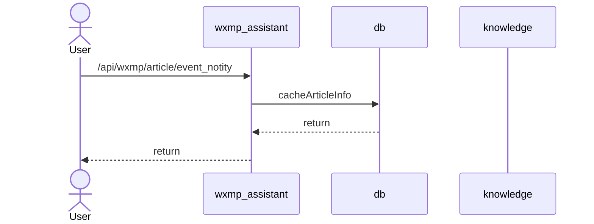
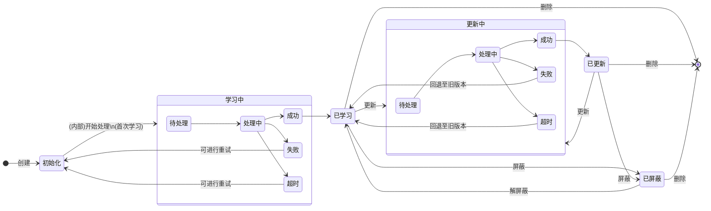
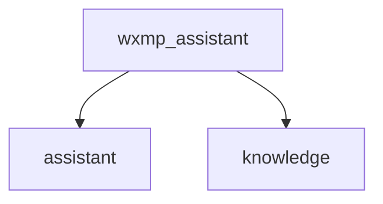

+++
date = '2025-11-12T10:00:00+08:00'
draft = false
title = '微信公众号km'
+++

<!--more-->

读者侧：

解决了什么问题？

- 回复大量私信
- 过往文章的使用

可以利用过往文章回复私信问题

那怎么使用的
- 一键创建智能体

技术侧：

1、RAG：
- 拉取公众号文章，起任务拉取
- 构建和召回
2、智能体中台-效果：
- 调试
- 创建两个智能体，正式和草稿态
3、千人千面：风格- 离线拉取微信公众号主的数据
- 提取公众号主风格
  遇到哪些问题：
- 用户连续问题处理
- 引文相关

对微信公众号分身技术方案感兴趣的人，
- 如何做到的千人千面，风格化？
- 如何处理公众号文章的？
- 如何调试智能体的？
- 如何处理消息的？
- 数据一致性的？
# 微信代理

# 智能体中台
- 调试预览，待效果满意后再手动发布，避免直接修改影响效果
- 追问
  - 
- 闲聊/知识库/追问链路：根据读者问题，利用模型(dsv3)进行分类 

- 保证消息顺序性：在回复消息前，在数据库中插入2条递增的消息
添加引文消息，然后发送给用户后，最后存到db中

消息处理：
拿到用户消息后，先将

# 知识库中台
## 构建
自定义知识库

自动学习近一年内所有的历史文章，默认知识库

涉及到3中操作：
- 添加
  - 将微信公众号主的历史消息格式化后存到数据库，应该是有个状态机的
- 更新
  - 直接调用异步接口更新
- 删除
- - 调用知识库的删除

状态机：

## 召回
# 效果

：

