+++
date = '2025-11-12T10:00:00+08:00'
draft = false
title = '《如何为微信公众号打造一个拥有记忆和风格的AI助手？》'
toc= true
+++

知识库方案：https://iwiki.woa.com/p/4014329265
解决了什么问题？

- 回复大量私信

- 过往文章的使用

可以利用过往文章回复私信问题

那怎么使用的？

- 一键创建智能体

技术侧：

1、RAG：

- 拉取公众号文章，起任务拉取

- 构建和召回

2、智能体中台-效果：

- 调试

- 创建两个智能体，正式和草稿态

3、千人千面：风格- 离线拉取微信公众号主的数据

- 提取公众号主风格

遇到哪些问题：

- 用户连续问题处理

- 引文相关

对微信公众号分身技术方案感兴趣的人，

- 如何做到的千人千面，风格化？

- 如何处理公众号文章的？

- 如何调试智能体的？

- 如何处理消息的？

# 微信代理

# 智能体中台

# 知识库中台

# 效果

<!--more-->

# 背景
在大型语言模型（LLM）驱动的Agent应用浪潮下，内容创作者对拥有个性化“电子分身”的需求日益增长。
在微信公众号的场景，公众号主面临的痛点：私信量大、回复不及时、重复性问题多、历史文章价值未被充分利用。
基于上述情况，我们设计并实现了一套基于检索增强生成（RAG）架构的智能回复系统。公众号主可在微信公众号后台一键开启智能回复，创建AI分身，它能学习公众号主的历史文章和风格，自动、智能地回复读者私信，并附带引文，有效盘活了内容资产，提升了互动效率。

本文看点: 本文将深入探讨该系统的核心技术挑战、整体架构以及关键模块（如知识库构建、千人千面风格化、Agent中台）的实现细节。

# 任务挑战
- 知识的高效利用: 公众号历史文章数以万计，内容非结构化。如何将这些海量文章转化为可供AI查询的精准知识库？如何保证AI回答时能准确引用原文（引文），而不是凭空捏造？
- 个性化与风格化: 每个公众号主都有独特的语言风格、性格和价值观。如何让AI的回答不像一个冷冰冰的机器人，而是模仿号主的口吻，实现“千人千面”？
- 复杂意图的理解: 用户的提问是多样的。如何设计一个系统，既能处理基于知识库的问答，又能应对闲聊、甚至能理解上下文进行追问？

# 技术实现
## 整体架构
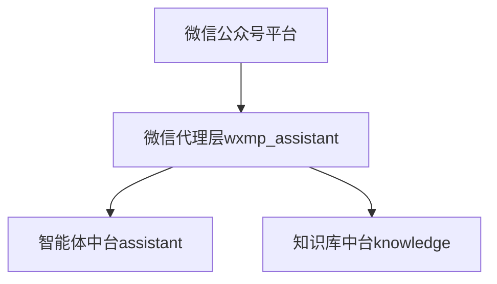
- 微信代理层：负责与微信公众号平台对接，处理公众号文章的拉取及消息的接收、发送，保证消息的顺序和一致性。
- 知识库中台: 负责公众号文章的接入、处理、向量化和存储，并提供高效的检索服务。
- 智能体中台: 系统的大脑。负责管理Agent的生命周期（草稿/正式态）、解析用户意图、编排工作流（是闲聊还是RAG）、注入风格化Prompt，并调用大模型生成最终回复。

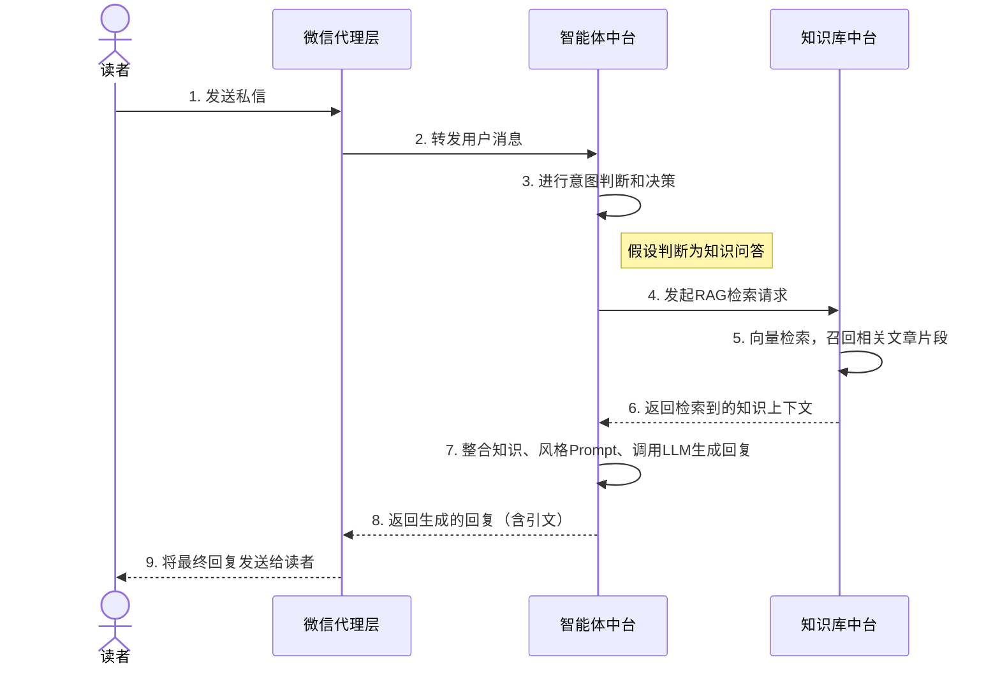
# 知识库中台：盘活历史文章
## 文章的自动化学习与管理 (构建):
事件驱动的接入: 讲解当公众号发布新文章时，系统如何通过回调接口 (/api/wxmp/article/event_notity) 自动触发学习流程。这里可以嵌入你的第一个sequenceDiagram。
文章处理状态机: 详细解释你的stateDiagram-v2。这是文章的一大亮点，清晰地展示了文章从初始化 -> 学习中 -> 已学习 -> 更新中 -> 已屏蔽 等状态的流转，体现了系统的鲁棒性。
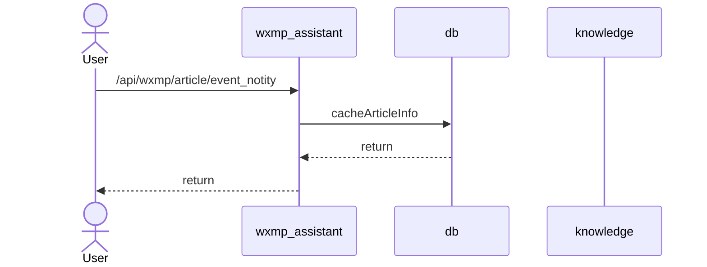

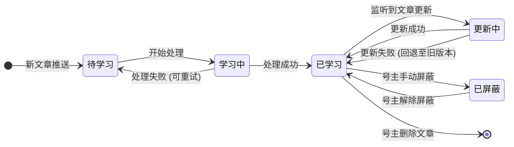
非结构化数据处理: 提及如何从HTML中提取正文、处理图片和格式，最终形成干净的文本块（Chunking）进行向量化。
多格式支持: 提及除了自动学习，还支持号主上传PDF/TXT/DOCX等文件创建自定义知识库。

## 高效的检索 (召回):
简单介绍RAG（Retrieval-Augmented Generation）的原理。
说明你们采用了向量检索技术，将用户问题转换为向量，在向量数据库中进行相似度搜索，召回最相关的文章片段。

一个好的引文功能，其基础是在数据入库时就打好的。我们不能只把文章内容向量化，还必须将每个文本块（Chunk）与其“身份信息”——即元数据——绑定在一起。
在处理每篇文章时，我们会：
内容清洗：去除HTML标签、广告、导航栏等无关信息，提取正文。
文本分块（Chunking）：将干净的长文本切分成有意义、有一定重叠（Overlap）的文本小块。
元数据绑定：为每一个文本块附加关键的元数据，至少包括：
article_id: 文章的唯一ID。
article_title: 文章标题。
article_url: 文章的永久链接。
chunk_index: 该文本块在文章中的序号。
关键点：当后续RAG检索召回任何一个Chunk时，我们都能立刻知道它来自哪篇文章、标题是什么、链接在哪里。这是实现精准引文的基石。
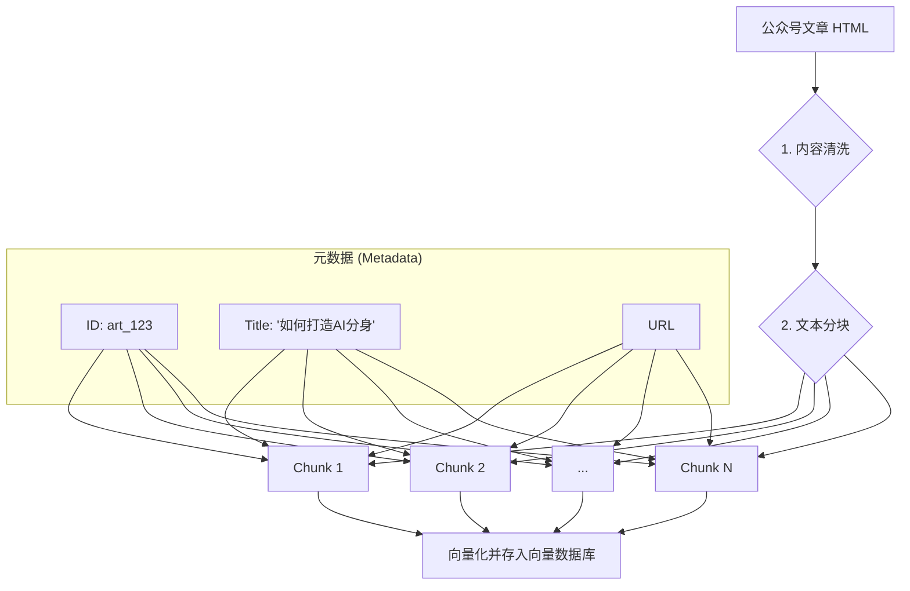

## 智能体中台
### 千人千面的风格化 (风格化)

方案一 (离线分析): 离线拉取号主历史文章和私信回复（如果数据可用），通过NLP技术（如词频、句式分析、情感分析）提取其语言特征，生成一个风格描述Prompt，例如：“你是一位风趣幽默的科技博主，常用'小伙伴们'、'yyds'等词语，喜欢使用emoji，语气亲切。”
方案二 (主动配置): 在公众号后台提供一个“AI人设”配置页面，让号主用自然语言描述自己的风格，或者回答一些引导性问题。
最终实现: 将上述生成的风格描述，作为System Prompt的一部分，在每次调用大模型时注入。

### 多意图处理链路
解释你的设计：“根据读者问题，利用模型(dsv3)进行分类”。这是一个典型的Router Agent。
分类: 将用户问题分为三类：知识问答（启动RAG流程）、闲聊（直接调用LLM闲聊）、追问（在Prompt中带上聊天历史）。
拒答机制: 提及如何识别敏感或不适宜回答的问题，并给出预设的礼貌性拒答回复。
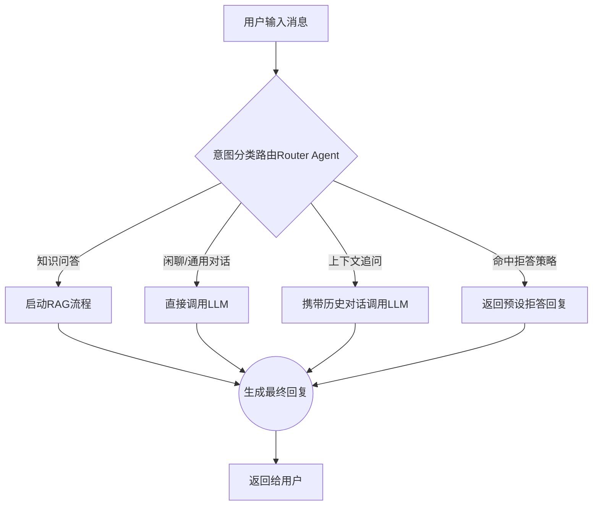
引文的生成与关联
当意图路由判断用户在进行知识问答后，引文的生成遵循以下步骤：
检索与筛选：智能体中台向知识库中台发起检索，获取到与问题最相关的Top-K个文本块（Chunks）。这些Chunks都带着它们的元数据。
构建Prompt：我们将这些Chunks的内容作为上下文（Context），连同用户问题一起，构建一个特定的Prompt提交给大语言模型（LLM）。这个Prompt有严格的指令：
"请你仅根据以下提供的资料来回答用户的问题。回答内容必须完全基于资料，不要使用任何外部知识。在回答结束后，请指出你主要参考了哪一份资料的ID。"
生成回复并提取来源：LLM根据指令生成答案。由于我们的特殊指令，我们可以更有信心地认为答案是基于所提供材料的。同时，我们也可以让模型直接返回它参考的article_id或chunk_index，或者我们自己根据返回内容与原始Chunks的相似度来判断主要来源。
组装引文消息：一旦确定了来源（例如，来自article_id: art_123的Chunk），智能体中台就会从元数据中提取文章标题和URL，组装成一条标准的引文消息，例如：“以上内容引自文章：<a href='文章URL'>《文章标题》</a>”。

### 安全发布与调试
强调“调试预览，待效果满意后再手动发布”的重要性。
解释草稿态（Draft）和正式态（Production）两个智能体的设计，可以让号主在不影响线上服务的情况下，安全地调试Prompt和知识库效果。
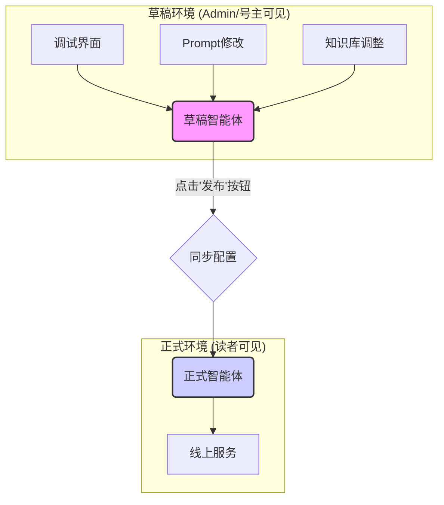

##  微信代理：确保消息可靠传递
挑战: 微信消息系统对顺序和实时性要求高。
解决方案:
保证消息顺序性: 详细解释你的数据库方案：“在回复消息前，在数据库中插入2条递增的消息（一条AI回复，一条引文消息）”。这可以解释为一种乐观锁或占位符机制，确保了消息发送的原子性和顺序性，是一个非常好的工程实践细节。
处理连续问题: 解释如何通过用户ID来维护一个会话上下文（Context），将最近的几轮对话历史传给智能体中台，让AI能够理解追问。
即使在发送过程中遇到网络问题或服务重启，由于数据库中已有记录，系统可以进行重试或状态回滚，避免了消息丢失或乱序的风险。

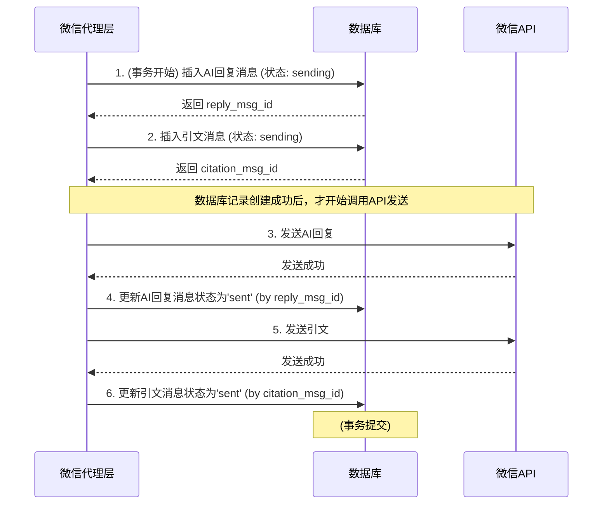

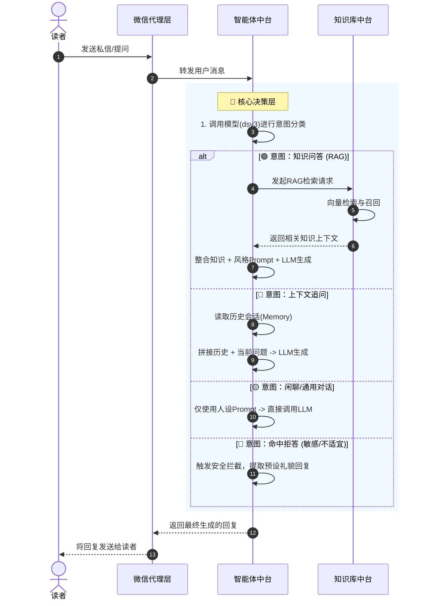

# 反思与展望
总结已解决的问题: 回顾开头，总结你是如何利用上述技术成功解决了大量私信回复、盘活过往文章、实现千人千面这三大核心问题的。
遇到的挑战与权衡: 分享一些真实遇到的困难，例如：
引文相关性不强或定位不准的问题，以及你们是如何通过优化Chunking策略或引入Re-ranking模型来改进的。
处理用户连续长对话时，上下文窗口（Context Window）的限制问题。
未来展望:
更精细的风格迁移模型。
支持图片、语音等多模态内容的理解。
赋予Agent更主动的能力，例如根据用户画像主动推荐文章。

----

这是一个非常好的调整方向。原本的结构是“背景 -> 挑战列表 -> 模块化技术实现”，这种写法虽然条理清晰，但割裂了“问题”与“对策”的联系，读起来确实会有一种“为了技术而技术”的感觉。

**调整思路：采用“挑战-解决方案（Challenge-Solution）”的行文逻辑。**

我们要把原本独立的“技术实现”章节拆解，将具体的模块设计、流程图、代码逻辑分别填入它们所解决的具体“挑战”中。这样能体现出**架构设计的目的性**。

以下是重构后的文章结构与内容建议：

---

# 打造微信公众号“AI分身”：基于RAG的智能回复系统实战

## 1. 背景与痛点
（保留原有背景，简述：内容创作者面临私信回复压力大、历史文章沉睡等痛点。核心目标是构建一个既能利用历史文章知识，又能模仿号主风格的AI Agent。）

## 2. 整体架构概览
在深入具体挑战之前，先展示系统的全貌。
（此处放置 `System Module Interaction` 的 Mermaid 架构图，并简要说明三大中台的分工，作为后续展开的地图。）

---

## 3. 核心挑战与技术攻坚

### 挑战一：海量非结构化文章，如何转化为精准答案？
**痛点：** 公众号文章数以万计，格式包含HTML、图片，且AI容易产生“幻觉”，如何保证回答有理有据（Citation）？

#### 解决方案 1：全生命周期的知识库状态流转
文章从发布到被AI学习，中间可能涉及更新、删除、屏蔽等复杂操作。我们需要一个健壮的状态机来管理文章的学习状态，确保知识库的实时性和一致性。

*   **事件驱动接入：** 利用微信回调 `/api/wxmp/article/event_notity` 实时感知新发文章。
*   **状态机设计：**
    （此处插入 `文章处理状态机` 的 Mermaid 图）
    *   **亮点：** 明确了 `Updating`（更新中）和 `Blocked`（已屏蔽）状态，不仅支持自动学习，还允许号主人工干预，防止过时或敏感文章被检索。

#### 解决方案 2：基于元数据绑定（Metadata Binding）的精准引文技术
AI不应该只返回答案，还必须告诉读者“答案来自哪篇文章”。
*   **实现逻辑：** 我们不能只对文本做向量化。在**清洗**和**分块（Chunking）**阶段，我们将 `Article_ID`、`Title`、`URL` 等元数据与每一个文本块（Chunk）强绑定。
*   **检索与生成：**
    （此处插入 `数据清洗与元数据绑定` 的 Mermaid 流程图）
    当RAG检索召回Chunk时，系统自动提取绑定的元数据，组装成HTML超链接格式的引文（Reference），从而彻底消除“凭空捏造”的风险。

---

### 挑战二：微信交互极其严格，如何保证消息必达且逻辑通顺？
**痛点：** 微信服务器对响应时间有要求，且网络波动可能导致乱序；用户的提问往往包含追问（如“它有什么优缺点？”），需要理解上下文。

#### 解决方案 1：基于“乐观锁”机制的消息可靠投递
微信代理层（WeChat Proxy）不仅是传话筒，更是消息一致性的守护者。
*   **顺序性保障：** 为了防止AI生成的长文本回复导致超时或乱序，我们在数据库层面采用了类似“乐观锁/占位符”的机制。在调用微信API前，先在DB中预占 `reply_msg` 和 `citation_msg` 的位置。
    （此处插入 `微信代理层序列图` - 这里非常适合展示这个事务逻辑）

#### 解决方案 2：多意图路由与会话保持
为了应对复杂提问，我们设计了智能体中台的大脑——**Router Agent**。
*   **意图分流：** 系统根据用户Query进行分类：
    *   **知识问答：** 走RAG链路。
    *   **闲聊/通用：** 走纯LLM链路。
    *   **拒答：** 命中敏感词拦截。
        （此处插入 `多意图处理链路` 的 Mermaid 流程图）
*   **上下文追问：** 系统为每个用户维护一个 `thread_id`。当Router判断为“追问”意图时，会从DB拉取最近N轮对话历史注入Prompt，确保AI能理解“它”指代的是什么。

---

### 挑战三：如何避免“机器味”，打造千人千面的个性化分身？
**痛点：** 同样的知识，科技博主和情感博主的回答语气应该截然不同。且号主不敢直接把AI放出去面对百万读者。

#### 解决方案 1：风格化Prompt注入
我们将“风格”解耦配置。号主可以通过自然语言描述（如“幽默、喜欢用emoji、自称本喵”），系统将其转化为 `System Prompt`，在每次调用LLM时动态注入，实现“千人千面”。

#### 解决方案 2：双环境隔离（Draft vs Production）
为了解决号主的“发布焦虑”，我们借鉴了软件工程的发布流程。
*   **草稿态（Draft）：** 号主调整Prompt和知识库后，只能在调试界面与“草稿Agent”对话。
*   **正式态（Production）：** 只有效果满意并点击“发布”，配置才会同步到线上，面向读者生效。
    （此处插入 `安全发布与调试` 的 Mermaid 图）

---

## 4. 总结与展望
（保留原有的反思与展望，总结通过上述技术手段，成功将被动的公众号文章变成了主动的智能服务资产。）

---

### 这样修改的优点：
1.  **逻辑闭环：** 每一节都是“抛出问题 -> 解决问题”，读者能立刻明白你为什么要设计这个状态机，为什么要搞这个代理层。
2.  **重点突出：** 将原本分散的“引文技术”和“RAG原理”整合到了“知识库挑战”中，显得技术深度更强。
3.  **叙事流畅：** 从数据处理（输入），到交互保障（传输），再到上层应用（输出与管理），符合系统数据的流向。

---

[[toc]]

# 一、背景
在大型语言模型（LLM）驱动的Agent应用浪潮下，内容创作者对拥有个性化“电子分身”的需求日益增长。
在微信公众号的场景，公众号主面临的痛点：私信量大、回复不及时、重复性问题多、历史文章价值未被充分利用。
基于上述情况，我们设计并实现了一套基于检索增强生成（RAG）架构的智能回复系统。公众号主可在微信公众号后台一键开启智能回复，创建AI分身，它能学习公众号主的历史文章和风格，自动、智能地回复读者私信，并附带引文，有效盘活了内容资产，提升了互动效率。

本文将深入探讨该系统的核心技术挑战、整体架构以及关键模块（如知识库构建、千人千面风格化、Agent中台）的实现细节。

# 二、系统模块交互
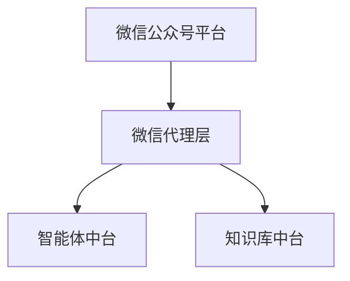
- 微信公众号平台：微信侧负责，与下游通过http接口通信
- 微信代理层：负责与微信公众号平台对接，处理公众号文章的拉取及消息的接收、发送，保证消息的顺序和一致性。
- 知识库中台: 负责公众号文章的接入、处理、向量化和存储，并提供高效的检索服务。
- 智能体中台: 系统的大脑。负责管理智能体的生命周期（草稿/正式态）、保存历史对话、解析用户意图、编排工作流（是闲聊还是RAG）、注入风格化Prompt，并调用大模型生成最终回复。

# 三、核心挑战与技术攻坚
## 挑战一 :海量非结构化文章，如何转化为精准答案？
公众号文章数以万计，面临双重难题：
1. 管理难： 文章会更新、删除或被屏蔽，如何保证AI学到的知识永远是最新、有效的？
2. 检索难： 内容包含HTML和图片，且上下文依赖强。简单的向量检索容易断章取义，导致AI一本正经地胡说八道。
### 核心机制 1：基于状态机的全生命周期管理（宏观一致性）
文章从发布到被AI学习，中间可能涉及更新、删除、封禁、解封等复杂操作。在深入处理内容之前，首先要确保“源头”的可靠性。我们设计了一套**事件驱动的状态流转机制**，确保知识库的实时性和一致性。
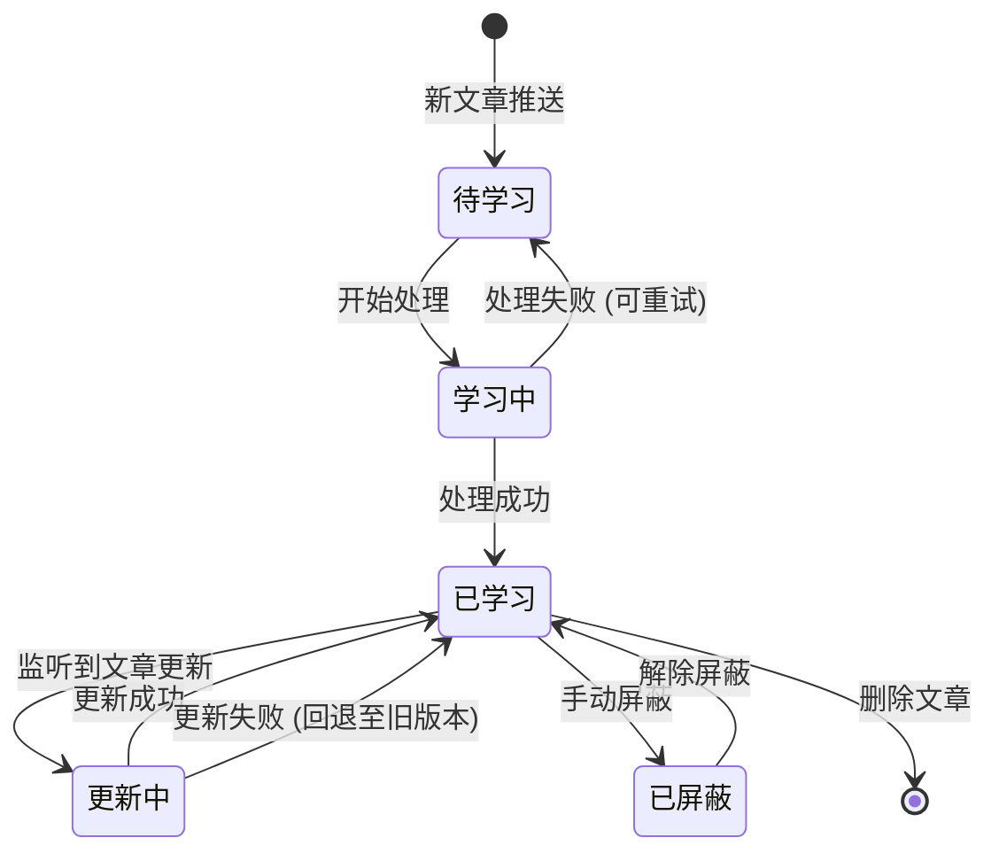

- 动态同步： 通过微信回调接口实时监听文章变动。
- 状态流转：
    - 当号主修改文章时，状态机触发重新学习流程，避免信息过时。
    - 当号主屏蔽某篇文章时，系统立即在知识库中标记不可用，确保AI不会引用敏感或已下架的内容。

---

### 核心机制 2：离线解析与多维混合存储（微观结构化)
有了可靠的源文章，下一步是将其转化为机器可理解的知识。
依据**离线解析架构**，我们构建了精细的入库流水线：

- **入库并发控制：** 利用 **Redis 分布式锁** 控制 filequeue 的处理顺序，确保在知识库更新时的数据一致性。
- **父子切片（Parent-Child Chunking）：**
    - 原始文档经 腾讯云提供的服务**LKE解析** 后，进行语义与窗口双重拆分。
    - **关键策略：** 建立“父子分片”结构。细粒度的“子分片”用于高灵敏度检索，而包含完整上下文的“父分片”存入 **MongoDB**，用于给LLM提供背景，解决断章取义问题。
- **多维存储：**
    - **语义层：** 子分片向量化后存入 **VDB**（向量数据库）。
    - **关键词层：** 子分片提取BM25特征存入 **ES**，为混合检索提供基础。

### 核心机制 3：漏斗式检索与精排链路（精准召回）

在用户提问时，我们通过一套严密的**在线检索“漏斗”**来锁定答案：
1. **Query 智能改写：** 用户提问往往模糊（如“它怎么收费？”），系统先通过 **多轮改写模型** 补全指代词，生成完整的搜索Query。
2. **多路召回 (Hybrid Search)：** 并行从 ES（字面匹配）和 VDB（语义匹配）检索，经 **多路合并** 保证召回广度。
3. **精排与过滤 (Rerank & Filter)：**
    - **精排：** 利用 **BGE 模型** 对召回结果进行深度的语义相关性打分重排。
    - **过滤：** 通过 **HY-7B 模型** 剔除低质量噪声。
    - **最终输出：** 只有经过层层筛选的 Top-K 切片，才会携带其元数据投喂给 LLM，生成精准且带引文的回答。

## 挑战二：面对复杂的真实对话，如何兼顾“理解力”与“可靠性”？

**痛点：** 用户的提问千奇百怪，有闲聊、有追问；同时，微信服务器对响应时效性要求极高，且网络环境可能导致消息乱序或丢失。
### 核心机制 1：碎片化消息的“缓冲聚合”策略

真实用户的聊天习惯往往是碎片化的。他们可能在几秒钟内连续发送多条短消息（如：“你好”、“在吗”、“有个问题想问”）。如果系统对每一条都立即响应，不仅会造成 Token 的极大浪费，还会导致 AI 回复频次过高，对用户造成“消息轰炸”。
我们引入了一个 **“消息缓冲区（Message Buffer）”** 设计：
1. **入队缓冲：** 当用户发送消息时，系统不立即处理，而是先将消息推入缓存队列（mongo）。
2. **定时轮询与聚合：** 系统通过定时器（或延时任务）轮询队列。一旦检测到队列中有待处理消息，系统会将队列中积累的所有消息一次性 **“出栈”**。
3. **合并处理：** 将这些碎片化消息拼接成一个完整的段落（Context），再交给 Router 和 LLM 进行处理。
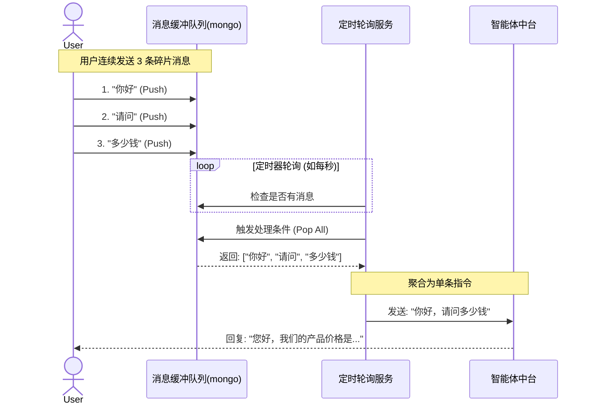

### **核心机制 2：** 多意图路由

我们无法用RAG处理所有问题，智能体中台引入了一个 **Router Agent（路由智能体）** 作为前置网关。 Router根据用户Query判断意图：是“知识问答”则查库，是“闲聊”则走LLM，是需要继续追问，则返回追问问题，是“敏感话题”则直接拦截。

### 核心机制 3：基于“响应驱动落库”的强一致性消息保障

为了确保系统维护的对话历史与用户微信端看到的完全一致，我们采用了“同步顺序执行 + 响应后落库”的强一致性策略。这种严苛的“写后读”一致性（Strong Consistency），确保了数据库中存储的每一条历史记录都是真实触达用户的。这完美避免了因发送失败导致的“脏数据”进入上下文，保证了下一轮对话时 LLM 对历史信息的理解是准确无误的。

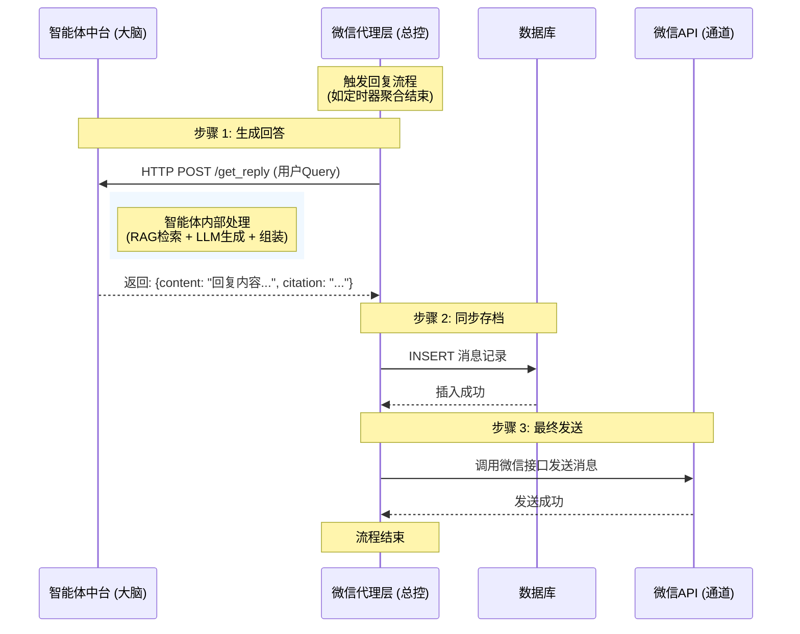

## 挑战三：如何避免“机器味”，让AI安全地代替号主营业？

**痛点：** 每个号主都有独特的语言风格（如幽默、严肃、卖萌），标准化的AI回复会破坏人设。此外，直接让AI面对读者存在内容安全风险。
### 核心机制 1：基于历史数据的“自动化风格克隆” pipeline

利用大数据和大模型技术，从号主过往真实的回复记录中“提取”灵魂。这是一套自动化的双循环离线处理流程：
1. 数据清洗与筛选（Spark 离线链路）：
   通过小时级的 **Spark 任务**，从数仓（TDW）拉取公众号的历史回复数据。系统会计算数据量是否达标（符合要求的 AppID），并将清洗后的语料写入 MongoDB，标记该智能体为“待生成风格”状态。
2. 风格提取与生成（模型推理链路）：
   通过分钟级的 **Timer 定时任务**，扫描 MongoDB 中待处理的智能体。系统将该号主的历史语料投喂给 **大模型（Model）**，让模型总结其语言特征（如常用词、语气、表情包习惯），自动生成专属的 Style System Prompt 并回写数据库。

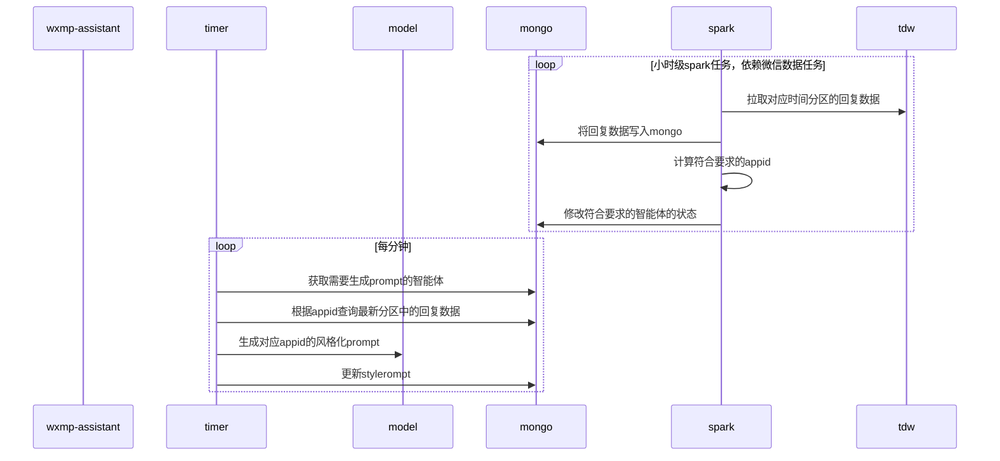

###  核心机制 2：双环境隔离的安全发布流（Draft vs Production）

借鉴软件工程的思路，我们设计了**草稿（Draft）**与**正式（Production）**双智能体，可以让号主在不影响线上服务的情况下，安全地调试Prompt和知识库效果。

安全调试： 公众号主调整Prompt或知识库后，仅在“草稿态”生效，此时公众号主可以在微信公众号平台预览界面与AI对话，调试效果。

一键发布： 只有当公众号主在调试预览中对效果满意，点击“发布”，配置才会同步到“正式态”面向全网读者。
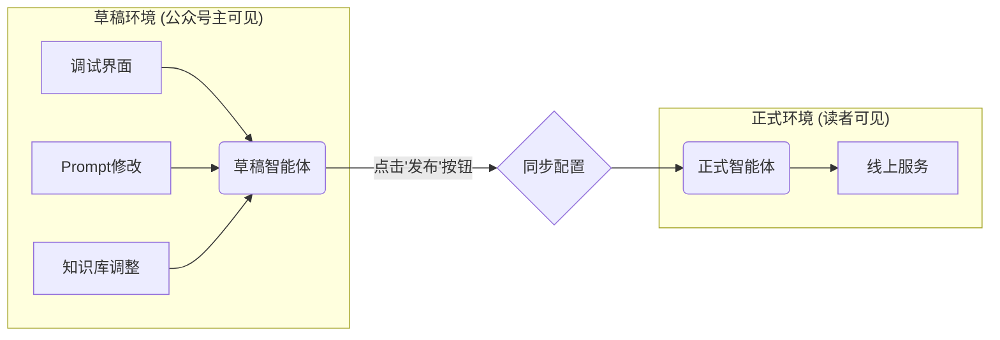

# 四、未来展望

## 1. 从“文本理解”走向“多模态感知”

目前的知识库构建主要聚焦于文本（HTML/Text）。然而，许多公众号文章的精华在于**图片、图表甚至内嵌视频**。
**规划：** 未来将引入 **多模态大模型（LMM）** 技术，在离线解析阶段对文章中的图片进行 OCR 和语义描述（Image Captioning），将视觉信息转化为向量存入 VDB。届时，用户发送一张产品报错截图，Agent 也能“看懂”并给出解决方案。
## 2. 从“被动应答”走向“主动运营”

当前的 Agent 主要是响应式（Reactive）的，即“你问我答”。
**规划：** 我们计划赋予 Agent **主动性（Proactive）**。结合用户的历史阅读画像和当前提问意图，Agent 可以在结束回答后，**“顺便”推荐**一篇号主刚刚发布的、与之高度相关的深度好文。这将彻底改变公众号的互动模式，将 Agent 从一个“客服工具”升级为“内容分发与粉丝运营专家”。
## 3. 更极致的风格迁移 (Style Transfer 2.0)

目前基于 Prompt 的风格注入虽然灵活，但在模仿号主深层价值观和思维逻辑上仍有局限。
**规划：** 依托现有的 Spark + TDW 数据管线，未来考虑引入 **LoRA (Low-Rank Adaptation)** 技术。利用号主积累的百万字语料，对底座模型进行**轻量级微调（SFT）**。这将使 AI 分身不再仅仅是“语气像”，而是真正习得号主的“思考方式”，打造真正的灵魂分身。
