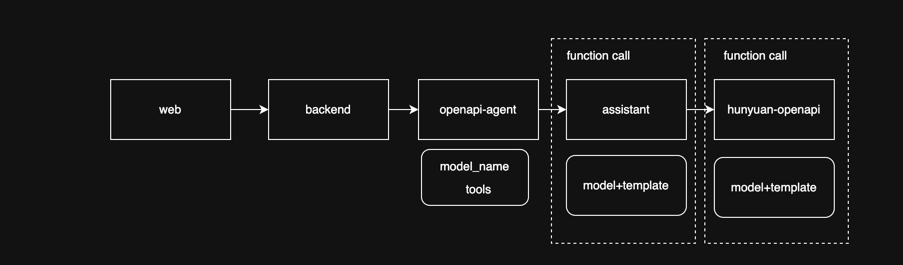

+++
date = '2025-06-09T14:42:33+08:00'
draft = true
title = '2025.06.10'
+++
做的好的：
- 工作上：小组内分享deerflow，调研的不错，于需求结合的也不错
- 注意身体：
  - 下午开始头痛，晚上早回家休息，注意身体
  - 早上晨跑3公里
  - 下载了测压力app，挺好玩，比自己更早意识到身体变化
- 上班路上听缠论，有点启发
 
待改进：
- 缠论笔记未立刻整理

<!--more-->
工作：
- 发布mcp到线上(实习生)
- 分享ppt
  - 在整理资料中，还没形成完整大纲
- 标注需求评审
  - deerflow展示及接口使用，结合昨晚的需求评审流程图
  - 分享了deerflow的调研，又分析了当前的系统架构及合理的架构

