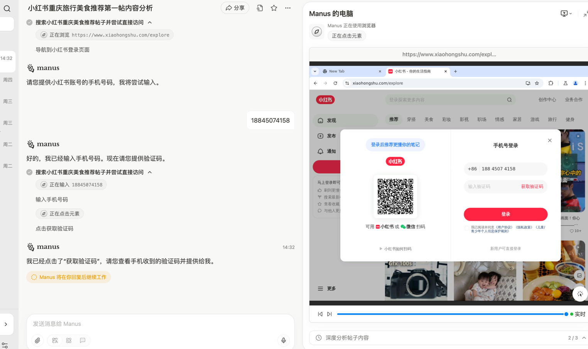

+++
date = '2025-07-07T10:16:33+08:00'
draft = true
title = '2025.07.07(Mon.)'
+++

梳理了工作思路，调整了重点，不是跟着产品后面，而是有想法做技术该做的
<!--more-->

# 工作：
- 搞demo!
  - 怎么搞？
    - 本地先写控制浏览器的脚本，能运行后
    - 去腾讯云上建个docker,Dockerfile
- 调研业界browser use 的人工介入程度
  - manus
    - 对需要的问题的方式暂停流程给用户判断
- 
- 
  - gemini
  - kimi
  - openai


```bash
1. 进入https://www.xiaohongshu.com/explore
2. 关掉登录弹窗
3. 进入第一个帖子
4. 把第一个帖子的内容卡片里的第一张图和文字内容扒下来（图片调用vision理解后转成文字） 
```

```bash
在沙箱里跑
第一阶段：使用固定的脚本，在沙箱里把browser流程串起来
第二阶段：使用hunyuan给出的脚本，在沙箱里把browser流程串起来
```


```python
import os
import base64
import time
from playwright.sync_api import sync_playwright, TimeoutError as PlaywrightTimeoutError
from openai import OpenAI
from dotenv import load_dotenv

# --- 配置 ---
# 加载 .env 文件中的环境变量 (OPENAI_API_KEY)
load_dotenv()

# 初始化 OpenAI 客户端
# 如果你的 .env 设置正确，这里会自动读取 OPENAI_API_KEY
try:
    client = OpenAI()
    # 检查API密钥是否被加载
    if not client.api_key:
        raise ValueError("OpenAI API key not found. Please check your .env file or environment variables.")
except Exception as e:
    print(f"Error initializing OpenAI client: {e}")
    print("请确保你已经创建了 .env 文件并在其中设置了 OPENAI_API_KEY。")
    exit()

# --- Vision API 函数 ---
def describe_image_with_gpt4v(image_bytes: bytes) -> str:
    """
    使用 OpenAI Vision API (GPT-4o) 来描述图片内容。
    """
    print("🤖 调用 Vision API 分析图片...")
    try:
        # 将图片字节转换为 Base64 编码
        base64_image = base64.b64encode(image_bytes).decode('utf-8')

        response = client.chat.completions.create(
            model="gpt-4o",  # 或者使用 "gpt-4-turbo"
            messages=[
                {
                    "role": "user",
                    "content": [
                        {
                            "type": "text",
                            "text": "请详细描述这张图片的内容，包括图片中的物体、人物、场景、氛围以及可能传达的信息。"
                        },
                        {
                            "type": "image_url",
                            "image_url": {
                                "url": f"data:image/png;base64,{base64_image}"
                            }
                        }
                    ]
                }
            ],
            max_tokens=500
        )
        description = response.choices[0].message.content
        print("✅ 图片分析完成！")
        return description
    except Exception as e:
        print(f"调用 OpenAI API 时出错: {e}")
        return "图片分析失败。"

# --- 主函数 ---
def main():
    with sync_playwright() as p:
        # 启动浏览器，建议使用 headless=False 进行调试，可以看到浏览器操作
        # 实际部署时可以改为 headless=True
        browser = p.chromium.launch(headless=False, slow_mo=500)
        context = browser.new_context(
            user_agent="Mozilla/5.0 (Windows NT 10.0; Win64; x64) AppleWebKit/537.36 (KHTML, like Gecko) Chrome/125.0.0.0 Safari/537.36"
        )
        page = context.new_page()

        try:
            # 1. 进入 https://www.xiaohongshu.com/explore
            print("🚀 正在访问小红书探索页面...")
            page.goto("https://www.xiaohongshu.com/explore", wait_until="domcontentloaded")
            
            # 等待页面加载一些基本内容
            page.wait_for_selector("#exploreFeeds", timeout=30000)
            print("✅ 页面加载完成。")

            # 2. 关掉登录弹窗
            print("🔍 正在检测登录弹窗...")
            login_popup_close_button = page.locator(".reds-login-modal .close")
            try:
                # 等待弹窗出现，如果5秒内没出现就认为它不存在
                login_popup_close_button.wait_for(state="visible", timeout=5000)
                login_popup_close_button.click()
                print("✅ 登录弹窗已关闭。")
            except PlaywrightTimeoutError:
                print("💡 未检测到登录弹窗，或弹窗已自动消失，继续执行。")

            # 3. 进入第一个帖子
            print("🖱️ 正在点击第一个帖子...")
            first_post_selector = "#exploreFeeds .note-item"
            # 等待帖子元素加载完成
            page.wait_for_selector(first_post_selector, state="visible", timeout=20000)
            first_post = page.locator(first_post_selector).first
            first_post.click()
            print("✅ 已进入帖子详情页。")

            # 4. 扒取内容卡片里的第一张图和文字内容
            print("📝 正在提取帖子内容...")
            
            # 等待帖子详情页加载完成（等待标题出现）
            title_selector = "h1.note-title"
            page.wait_for_selector(title_selector, state="visible", timeout=20000)

            # 提取文字内容
            title = page.locator(title_selector).inner_text()
            description = page.locator("div.desc").inner_text()
            
            # 提取第一张图
            # 小红书的图片在轮播组件中，当前活动图片通常有特殊类名
            image_selector = ".swiper-slide-active .canvas-img"
            page.wait_for_selector(image_selector, state="visible", timeout=20000)
            image_element = page.locator(image_selector).first
            
            # 对图片元素进行截图，得到图片的二进制数据
            image_bytes = image_element.screenshot()
            print("✅ 图片和文字内容提取成功！")

            # 调用 Vision API 分析图片
            image_description = describe_image_with_gpt4v(image_bytes)

            # --- 打印结果 ---
            print("\n" + "="*50)
            print("✨ 小红书帖子内容提取结果 ✨")
            print("="*50)
            print(f"🔗 帖子链接: {page.url}")
            print("\n--- 📝 帖子原文 ---\n")
            print(f"标题: {title}\n")
            print(f"内容:\n{description}")
            print("\n--- 🖼️ Vision API 图片解读 ---\n")
            print(image_description)
            print("\n" + "="*50)

            # 暂停，方便查看结果
            print("\n✅ 任务完成，浏览器将在15秒后自动关闭...")
            time.sleep(15)

        except Exception as e:
            print(f"\n❌ 执行过程中发生错误: {e}")
            # 发生错误时截图，方便调试
            page.screenshot(path="error_screenshot.png")
            print("已保存错误截图到 error_screenshot.png")
            
        finally:
            browser.close()
            print("👋 浏览器已关闭。")


if __name__ == "__main__":
    main()
```
# 提升
- 功能性瑜伽，觉得今天体力一般，应该是昨天没睡好，慢慢来

# 其他：
