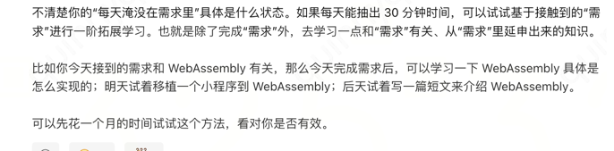

+++
date = '2025-07-10T10:16:33+08:00'
draft = false
title = '2025.07.10'
+++
过程艰难，但AI真好用，整理一下遇到的问题，收获不小

<!--more-->

工作：
- 部署browser use demo


# [root@VM-88-228-centos browser-use]# docker logs 51d04a33dbb2
Error: Can't drop privilege as nonroot user  [supervisord]
好的，这是一个非常经典且优质的问题，它清楚地展示了在使用 Docker、非 root 用户和进程管理器（如 Supervisor）时一个常见的困惑点。

下面我将为你详细剖析问题原因，并提供解决方案。

### 问题分析

1.  **错误信息解读：** `Error: Can't drop privilege as nonroot user [supervisord]`
    *   **它在说什么：** `Supervisor` 告诉你，它尝试切换到一个不同的用户来运行某个程序，但失败了。这个操作（“降权”或“切换用户”）需要 `root` 权限。错误信息明确指出，`Supervisor` 程序本身正在以一个 **非 root 用户（nonroot user）** 的身份运行。

2.  **Supervisor 为什么以非 root 身份运行?**
    *   我们来看你的 `Dockerfile`，最后几行是关键：
        ```dockerfile
        # 7. 以非 root 用户身份安装项目级的 Playwright
        USER ${APP_USER}
        WORKDIR ${APP_HOME}
        RUN npm install playwright@${PW_VERSION} && rm -rf /tmp/* ~/.npm
        
        # 8. 暴露端口，并设置默认命令
        EXPOSE ${NOVNC_PORT}
        EXPOSE ${PW_PORT}
        CMD ["/usr/bin/supervisord", "-c", "/etc/supervisor/conf.d/supervisord.conf"]
        ```
    *   `USER ${APP_USER}` 这条指令（这里的 `${APP_USER}` 是 `pwuser`）会设置后续所有指令的默认执行用户。
    *   因此，你的 `CMD` 命令，也就是启动 `supervisord` 的命令，最终是以 `pwuser` 这个普通用户的身份执行的。

3.  **Supervisor 为什么需要“降权”？**
    *   我们再看你的 `supervisord.conf` 配置文件。你管理的每一个程序都有这样一行：
        ```ini
        user=pwuser
        ```
    *   当 `Supervisor` 看到 `user=` 这个指令时，它的工作职责就是去把指定的程序（如 vnc, fluxbox 等）以 `pwuser` 这个用户的身份启动。要完成这个任务，它需要调用一个系统函数来改变进程的用户 ID。
    *   **只有 `root` 用户才有权限将一个进程的用户 ID 切换成别人。**

**核心矛盾点：** 你让 `supervisord` 主进程以普通用户 `pwuser` 的身份运行，然后又在它的配置文件里要求它去执行“将子进程切换到 `pwuser` 用户下运行”这个操作。尽管目标用户是它自己，但 `supervisord` 的内部逻辑决定了处理 `user=` 指令这个行为本身就需要 `root` 权限。

---

### 解决方案

你有两种方法可以解决这个问题。方案一是更正确、更标准的方式。

#### 方案一 (推荐): 让 `supervisord` 以 `root` 身份运行

进程管理器（`supervisord`）理应以 `root` 身份运行，这样它才能正确地管理它的子进程，包括将子进程降权到非特权用户（`pwuser`）下运行。这本身就是 `Supervisor` 的设计理念。

**如何修改：**
在你的 `Dockerfile` 中，在 `CMD` 指令之前，简单地切换回 `root` 用户即可。

**修改后的 `Dockerfile` (只改动末尾部分):**
```dockerfile
# ... (前面所有内容保持不变)

# 7. 以非 root 用户身份安装项目级的 Playwright (这是好习惯)
USER ${APP_USER}
WORKDIR ${APP_HOME}
RUN npm install playwright@${PW_VERSION} && rm -rf /tmp/* ~/.npm

# --- 修复：切换回 root 用户来运行进程管理器 ---
USER root

# 8. 暴露端口，并设置默认命令
EXPOSE ${NOVNC_PORT}
EXPOSE ${PW_PORT}
CMD ["/usr/bin/supervisord", "-c", "/etc/supervisor/conf.d/supervisord.conf"]
```

**为什么这是最佳方案：**
*   **正确性：** 完全符合进程管理器的设计模式和工作原理。
*   **安全性：** 你实际的应用程序（`vnc`, `fluxbox`, `novnc`, `playwright-service`）仍然会按照 `supervisord.conf` 的配置，以非特权的 `pwuser` 用户运行。只有 supervisor 守护进程本身是 root，这是一个标准且安全的模式。
*   **灵活性：** 如果未来你需要增加一个以其他用户身份运行的服务，这个架构也能毫无问题地支持。

---

#### 方案二 (备选): 从 `supervisord.conf` 中移除 `user` 指令

如果你坚持要让 `supervisord` 以 `pwuser` 身份运行，也是可以的，但你必须移除那些要求它切换用户的配置。

**如何修改：**
修改你的 `supervisord.conf` 文件，将所有 `[program:*]` 区块下的 `user=pwuser` 这一行都删除或注释掉。

**修改后的 `supervisord.conf` (部分示例):**
```ini
[supervisord]
nodaemon=true
# 主进程将由 Docker CMD 以 pwuser 身份启动
# 所以这里不需要 user 指令

[program:vnc]
command=Xvnc :1 -geometry %(ENV_VNC_RESOLUTION)s ...
priority=10
# user=pwuser  <-- 移除此行
environment=HOME="%(ENV_APP_HOME)s",USER="%(ENV_APP_USER)s"
...

[program:fluxbox]
command=/usr/bin/fluxbox
priority=20
# user=pwuser  <-- 移除此行
environment=DISPLAY=":1"
...

# ... 其他 program 区域也做同样修改
```

**为什么这样能行：**
如果没有 `user` 指令，`Supervisor` 会以它自身的身份来启动子进程。既然你的 `Dockerfile` 已经指定了 `supervisord` 以 `pwuser` 身份运行，那么它启动的所有子进程也会自然而然地继承 `pwuser` 这个身份。

**为什么不那么理想：**
*   **不够直观：** 配置文件本身不再明确声明应用是以哪个用户运行的，而是依赖于启动 `supervisord` 的用户身份，可读性稍差。
*   **丧失灵活性：** 你失去了让 `Supervisor` 管理不同用户进程的能力。它管理的所有进程都只能以 `pwuser` 的身份运行。

### 总结

| 对比维度 | 方案一 (supervisord 以 root 运行) | 方案二 (移除 user 指令) |
| :--- | :--- | :--- |
| **工作原理** | `root` 的 supervisord 把子进程降权为 `pwuser`。 | `pwuser` 的 supervisord 直接以自身身份 (`pwuser`) 启动子进程。 |
| **正确性** | **高。** 这是 `supervisor` 的标准用法。 | **中。** 能用，但依赖于隐式行为。 |
| **安全性** | **高。** 应用程序以非 root 运行，`supervisor` 本身是安全的。 | **高。** 应用程序同样以非 root 运行。 |
| **灵活性** | **高。** 可以管理任何用户的进程。 | **低。** 所有进程必须和 `supervisor` 是同一用户。 |

**结论：我强烈推荐你使用 **方案一**。** 它是最健壮、最正确、也最易于维护的容器化实践方式。