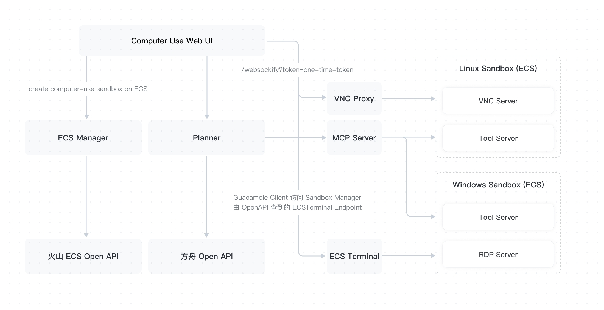

+++
date = '2025-07-21T10:29:33+08:00'
draft = true
title = '2025.07.21(Mon.)'
+++
😷一周了，怎么还不好
<!--more-->

工作：
- 调研司内browser use 情况 
  - 司内倒是暂时没什么,最多是playwright的mcp，但是不好用
- 司外倒是有，火山引擎的挺牛的，支持window\linux，底层是CVM
- 调研 browser use 如何自证？
  - 评测报告，manus那些案例跑通是不是就可以
    https://github.com/openai/simple-evals
  - https://openai.com/index/browsecomp/

提升：
- 基础13

其他：
- 上周五请病假，在家躺

