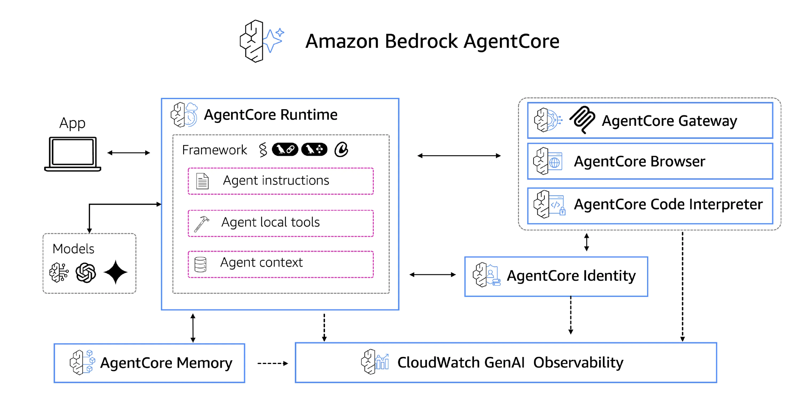

+++
date = '2025-07-23T10:26:00+08:00'
draft = true
title = '2025.07.23'
+++
<!--more-->

工作：
- tts分工开会
  - 咋说呢，多模态音频相关的，属于有业务和用户的状态吧，但是不想去，因为想做agent，不知道什么时候才可以做多智能体啥的，学学python也不错
- 发现AWS新发布的Agent Core 很不错
  - 发布会: https://www.youtube.com/watch?v=2890bEb61qQ
    https://www.infoq.cn/article/U3ObmgEgGro1taUAamjS
    https://aws.amazon.com/ai/agentic-ai/?nc2=h_l1_f

提升：
- 基础15、16
- xmind笔记
- 普拉提
  - 这普拉提上的生了一肚子起，歌超级难听，跟进了什么蹦迪场子似的，动作也不咋地，不专业，上一半走了，还忘记签到了

其他：
- https://www.infoq.cn/article/DsWlrrpTYg9pSTB7juw1
  - 编程新未来：openai "在 AI 驱动的时代，清晰、具有人类可读性的规范（spec）将取代传统代码，成为软件开发的核心产物"
  - 新的稀缺技能将是如何编写能够全面捕捉意图和价值取向的规范

