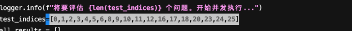

+++
date = '2025-08-27T10:00:00+08:00'
draft = true
title = '2025.08.27'
+++

<!--more-->

工作：
- 统计报错

提升：
- 普拉提

其他：

Level1:
- "6f37996b-2ac7-44b0-8e68-6d28256631b4" : 20 :可重试 markdown,没报错，模型效果
- "72e110e7-464c-453c-a309-90a95aed6538" : 13 :被限流，可重试 - 理论可对
  "840bfca7-4f7b-481a-8794-c560c340185d" : 45 ：可重试 "content": "{'error': \"Error executing async tool 'browse_url': list index out of range\"}",
  "a1e91b78-d3d8-4675-bb8d-62741b4b68a6" :  4   视频-模型问题
  "e142056d-56ab-4352-b091-b56054bd1359"： 36 模型问题
  "9318445f-fe6a-4e1b-acbf-c68228c9906a"    21 模型问题
  "cca530fc-4052-43b2-b130-b30968d8aa44"     16
  "e1fc63a2-da7a-432f-be78-7c4a95598703" 0
  "935e2cff-ae78-4218-b3f5-115589b19dae" ： 17 可重试 "content": "{'error': \"Error executing async tool 'brows
  "d0633230-7067-47a9-9dbf-ee11e0a2cdd6"31
  "7673d772-ef80-4f0f-a602-1bf4485c9b43"      38
  "a0c07678-e491-4bbc-8f0b-07405144218f" ： 50   可重试 "content": "{'error': \"Error executing async tool 'brows

Level2 :

23道模型效果问题

level3:

