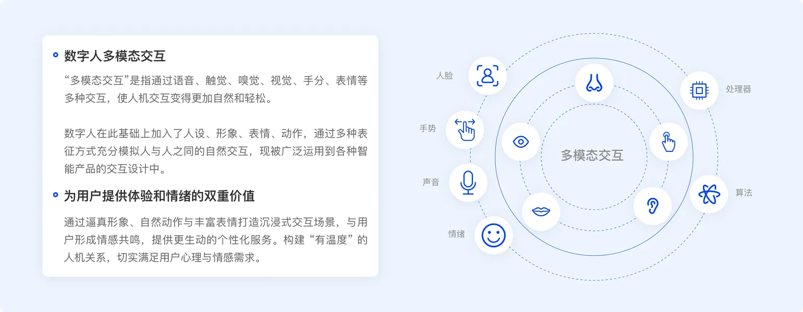

+++
date = '2025-09-15T10:00:00+08:00'
draft = true
title = '2025.09.15'
+++
周末约了子舜哥做教练，收获颇丰，开始行动！

<!--more-->

工作：
- AI 搭子 等steven的架构，出协议
  - 算法换人了，先不用管
- Unified Agentic Data Synthesis 不知道有啥需求，暂时还不是很明确
  - 定个计划，一会日会的时候提一下吧，没开日会
  - 先用一下，感觉只有个框架，确实没啥内容
- 安全漏洞修复
  - eip不知道在哪用的，改了也没生效

提升：
- 梳理公司产品
  - [《从技术到场景：蚂蚁数字人多模态交互在金融领域的应用分析》](https://km.woa.com/articles/show/629876?kmref=badge)
  - 多模态：图片/音频/视频 
  - 通过AB test做效果验证
  - 价值：效率纬度、情感纬度
  - 数字人形象设计及选择，做实验
- 功能性瑜伽
  - 确实感觉身体拉伸的更多了，上课还被老师夸动作做的标准哈哈哈哈，开心了，对了有点想报名她的私教，不知道

其他：

