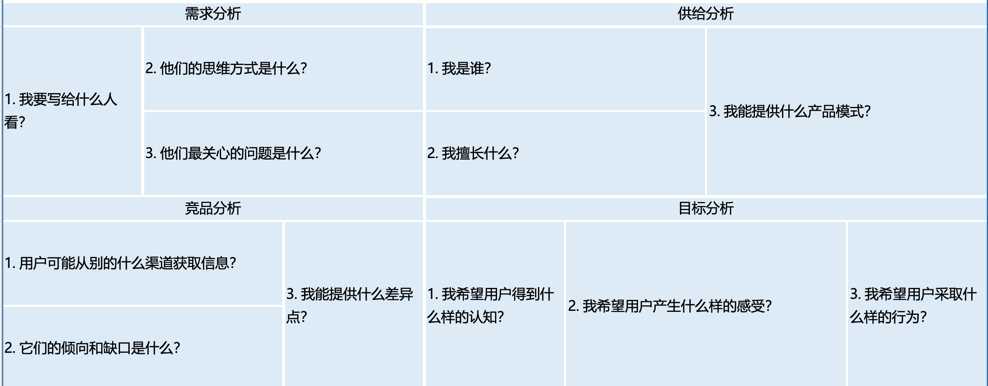

+++
date = '2025-10-27T10:00:00+08:00'
draft = true
title = '2025.10.27-开始写作的第一天！'
+++
今天听了个理论：给每天都赋予意义，这样每天都可以感到很幸福，提高能量，未尝不可

就从这天开始吧

今日意义：开始写作的第一天！

<!--more-->

工作：
- wx的需求吧
  ~~- 要做完这个，好吧，先从表开始
  - ~~这个表 需要建个导出任务，看下是不是appid-标签的对应关系表~~
  - 然后对应添加system prompt就行了
- ~~工作交接填表~~
- RL概述
  - 写了1/3

提升：
- L13
- ~~功能性瑜伽~~
- 写作

其他：

写作第一要素：客户分析

