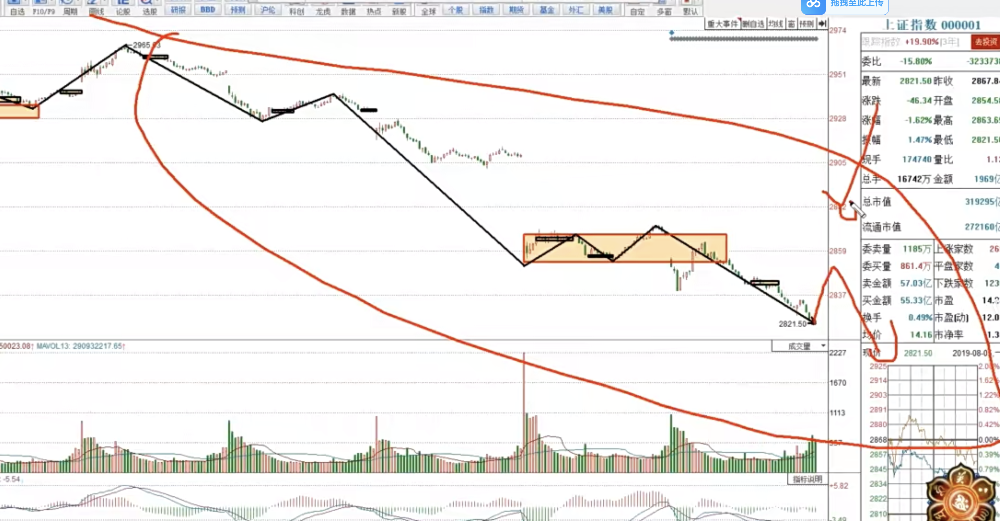
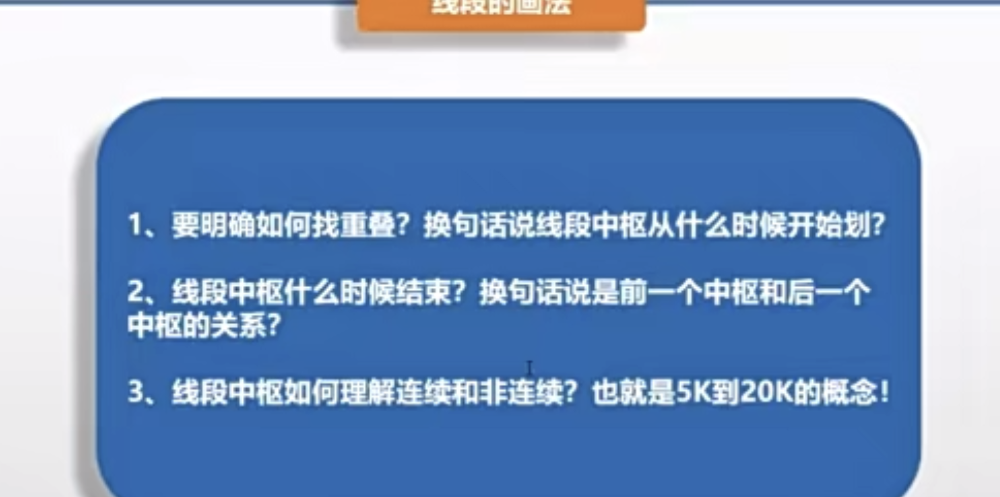
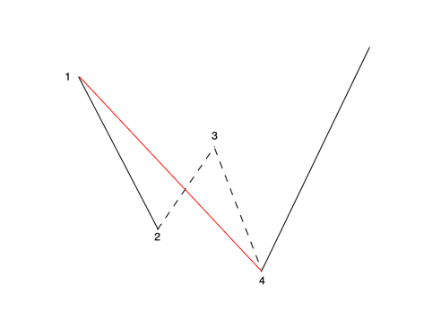

+++
date = '2025-06-11T10:42:33+08:00'
draft = false
title = '缠论'
pinned=true
+++
<!--more-->

# 心态
炒股始于不能赚钱
- 个人&机构：小资金和大资金是完全不一样的玩法
- 如果要开始学，就要向着大目标去努力，否则付出和回报不成正比
- 完整周期大概在9-12个月，但课程学习只需要4个月
- 预习、基础、直播
- 高阶的同学：主要是在二阶段

# 预习01  
职业交易者的缠论核心

缠论：以中枢为核心，走势分类和级别为2个基本点
体系要成“球”
名词：
- 中枢
- 走势分类
- 级别
- 买卖点
- 线段

中枢唯一，走势分类唯-->买卖点唯一

基本的：30-50W 3-5年做到1000w

交易模式：量化+认知

# 基础01 

目录：
- 线段画法的由来
- 4个必要条件

概念：
- 笔：可以表达走势的最小级别
- 线段：次级别走势
- 中枢：表达市场行情的涨跌

笔*3=线段

线段*3=中枢 

由于笔在实战中经常级别混乱，所以**不画笔，直接画线段**

## 怎么画线段？

必要条件：
- 顶底唯一
- 价格重叠存在：
    - k线破坏：
        - 最高价被向上破坏，只要价格不创新高，小于等于都可以
        - 最低价被向下破坏，------------低，大---------
    - 从被破坏的开始算第一根k,破坏者与被破坏形成的价格重叠区域向后画方块，看看能覆盖多少根k线，最高价和最低价都算在内
- 包顶底至少13K，其中5K价格重叠，连续非连续均可
    - 若出现连续20k及以上，则升级为本级别中枢

实战：
- 画上证指数/个股来练习

日=3 * 30分钟=9 * 5 分钟

当前只看日/30分钟/5分钟/1分钟

操作在5分钟级别

炒股的魅力在于持续稳定的盈利

若想止跌，则必须出现三买/三卖信号

### 补充

线段指的是次级别
可以去找： 上证指数、判断个股的涨跌

# 基础02
## 线段中枢的唯一
- 新的成立就是旧的不再延伸
- 前后两个中枢没有关系

形成线段中枢：
- k线破坏
- 重叠区域有5k

做交易的时候永远只有最近的中枢==》"当下"

非连续20K：
- 若有k线被破坏，但后续持续震荡，则未形成新的中枢
- 前后两个中枢绝不重复

散户：5-30分钟滚动，3-5年30w->1000w
充分发挥资金的灵动性，买点买，卖点卖

线段中枢如何确定连续、非连续？
- 虽在一个中枢里，但没有价格重叠

连续20k可以升级为本级别中枢

## 如何找顶底
交易模式=知行合一+择时+选股
做XMind框架

顶底？3个条件
- k线破坏
    - 先看后两根，不创新高/低
    - 前2根，若向上线段，第一根低于或等于中间
    - 上涨只看最高价，下跌只看最低价
- 顶和底至少其一满足独立2根k线
- 顶底之间形成13k

# 基础03 跳空的处理
- 为了满足价格的连续性
- 一定是现有顶底，再有中枢，再有13k
## 跳空的破坏如何找中枢的重叠
- 重叠上轨：被破坏k的最高价
- 重叠下轨：被破坏k的最低价
结论：破坏与被破坏的并集

## 跳空可以做1-2k处理？
- 中枢的跳空处理为1k => 凑5k
  - 前面有4k，然后跳空 => 才有可能成为中枢
  - 无论是中间跳空还是旁边跳空，只要是围绕中枢，就是1k
- 非中枢，凑13k时，算2k

30分钟=5分钟*3
以日线为基准看走势分类，走势分类唯一 <=> 日线级别

## 线段的转折和延伸（向下）

- 出现新低点，且2-3/3-4不是线段，就可以考虑向下延伸
- 一定要有转折

转折的4个必要条件：
- 1 破坏
- 2 被破坏
- 3 实体部分突破1、2重叠
- 4 像上k线破坏

