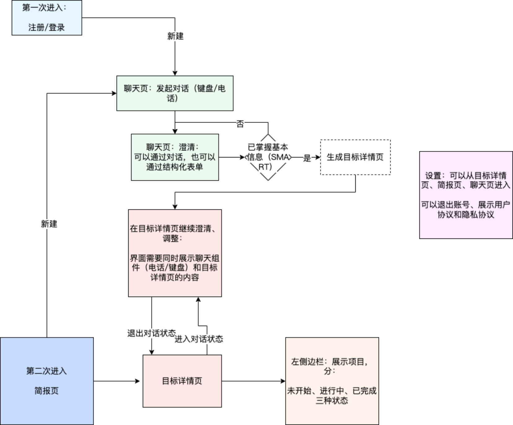
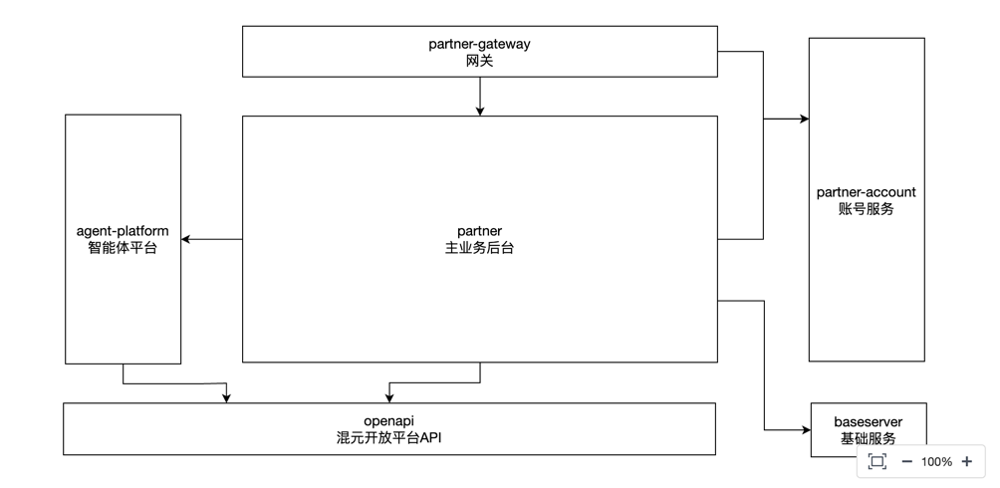

~~+++
date = '2025-09-10T17:55:00+08:00'
draft = false
title = 'AI搭子'
+++

# 产品角度
## 目标
个人+目标
AI搭子（AI partner）小程序是一款基于LLM创建一个用户空间，帮助用户创建、管理和分享个人项目。
产品通过AI交互辅助用户进行目标澄清、目标拆解和计划输出，支持项目分享与协作，涵盖出行、技能学习、运动健康、主题信息追踪等多个领域，通过AI+项目构成多边关系的协作型工具产品。
当前市场在简单的习惯打卡应用和复杂的企业级项目管理工具之间存在一个巨大的断层。前者功能单一，无法应对复杂目标；
后者则为企业效率设计，缺乏对个人生活目标和情感动机的关怀。
AI Partner将精准切入这一蓝海市场，为个人和小型团体的目标实现提供一个全新的、定制化的解决方案，成为一个介于个人教练、项目经理和社交工具之间的新物种。

AI Partner定位：“目标达成引擎”
●它比习惯追踪器（如Streaks、Habitify）更复杂、更具战略性。这类应用非常适合记录离散的、重复性的任务（如喝水、跑步），但对于需要多步骤、长周期的复杂项目（如学习一门语言、出版一本书）则显得力不从心 6。
●它比企业级项目管理（PM）工具（如Asana、ProjectLibre）更具个性化和消费者导向。尽管这些工具已经具备了利用AI生成项目计划的能力 7，但其设计理念、交互语言和功能集都是围绕企业效率、资源分配和流程标准化展开的，无法满足个人用户在真实生活中的复杂性、情感需求和内在动机。
因此，AI Partner应被市场定义为一个全新的品类：“目标达成引擎”或“交互式人生规划师”。它融合了项目管理软件的战略规划能力、私人教练的心理激励技巧以及社交游戏的参与感和粘性。
## 背景
调研了商业的计划生成+生产力产品合集，发现有个能力空缺，就是针对个人的
当前AI工具的失败并非技术故障，而是一种设计上的局限性。它们将管理上下文、整合建议、追踪进度的全部认知负荷都转嫁给了用户。
AI Partner的核心创新正是要颠覆这一模式：由AI通过其独特的交互式“容器”，主动承担上下文的获取、管理和应用责任。
如果缺乏一个能够持续演化的上下文模型，其输出的建议最终仍会退化为通用模板 。
2.1 类别一：个人目标与习惯追踪器（现有玩家）
●Fabulous
该应用的优势在于强大的品牌叙事（“基于行为科学”）和结构化的、循序渐进的用户引导。然而，其弱点也同样明显：用户反馈其入门流程“冗长乏味”，用户体验设计存在“噱头化”倾向，且其营销宣传与实际产品体验存在脱节。其每年39.99美元的订阅价格，为市场设定了一个高端个人提升应用的定价参考。
●Habitica
Habitica的优势在于深度游戏化和强大的社交协作层（“队伍”和“任务”系统）。通过将现实生活任务转化为角色扮演游戏，它成功地构建了一个高度忠诚的社区。其开源性质和免费增值模式（通过售卖虚拟装饰品或订阅服务盈利）是其成功的关键。
●Todoist
作为一款成熟且功能强大的任务管理器，Todoist是生产力工具市场的标杆。其Pro版本每月4美元的定价和将AI助手作为高级付费功能推出的策略，为C端生产力应用的商业化提供了重要的参考基准。
这些竞争者揭示了一个“用户参与度策略”的光谱。

Fabulous采用的是引导式的科学叙事，
Todoist依赖纯粹的实用性 ，
而Habitica则运用深度社交游戏化。

AI Partner拥有一个独特的机会，可以整合这三者的优点：提供一个基于科学理论的规划流程（类似Fabulous，但执行得更好），具备强大的任务管理功能（类似Todoist），并融入引人入胜的社交协作机制（类似Habitica，但与计划本身深度融合）。
2.2 类别二：AI增强型生产力平台（行业巨头）
●Notion
如前所述，Notion是AI Partner的参照物。
它的AI功能强大但用途广泛，服务于其灵活的工作空间。其定价模型的演变——从最初的AI附加包，到后来直接整合进每月20美元的商业版计划中——清晰地表明，深度整合的AI功能可以支撑高昂的定价，但其主要目标用户是重度使用者和企业团队。
●Asana
Asana的AI功能展示了在订阅制基础上，采用按用量计费（AI Actions）的可行性。这是一种成熟的商业模式，旨在平衡AI服务的成本与用户获取的价值。其高昂的定价和企业级的定位，为消费级市场留下了巨大的空间。
这些实践表明，底层的AI技术（如GPT模型）正迅速商品化。它们真正的护城河在于其独特的“应用层”——即它们将AI无缝整合进现有工作流（工作空间和项目计划）的具体方式。AI Partner的护城河也将是其独特的应用层：一个专为个人目标达成而设计的、集规划、追踪、激励和协作为一体的全新工作流。一个用户虽然理论上可以用Notion AI来创建目标计划，但他必须自己设计数据库、编写提示词、构建整个框架。AI Partner则将这个过程自动化，它提供的是一个开箱即用的解决方案，而Notion提供的是一个通用工具集，这是两者战略定位的根本区别。
## 路径

总共分3阶段走：
1.0 个人+小程序冷启动 : 首先，验证动态计划生成器（1.0）；
2.0 团队: 其次，引入社交协作与主动式AI助理功能（2.0）
3.0 社区: 最终，构建一个由用户贡献内容驱动的模板平台生态（3.0）。

后续会考虑app+ openapi:市场切入方面，将优先选择微信小程序作为冷启动平台，充分利用其强大的社交生态和消息触达能力，随后扩展至独立APP及B端API服务。
商业模式将采用面向个人消费者（C端）和企业客户（B端）并行的双轨制。

## 差异护城河
用户数据 + AI效果
产品必须在初次体验上就超越用户与通用大语言模型（LLM）的交互预期，让用户感知到这不仅是一个工具，更是一个能理解并伴随其成长的伙伴。这种卓越的初始用户体验，将是构建长期用户粘性和数据壁垒的基石。

## 市场机会
缓解策略： 上市速度至关重要。在此之外，真正的防御在于用户体验的深度——AI“智能探询”的质量、激励性推送的同理心、以及社区功能的粘性。这些围绕“人”的软性功能，远比基础的计划生成功能更难被完美复制。

亮点：
- 技术后台初版使用工作流引擎搭建，快速跑通产品流程
- 

<!--more-->

工作流引擎：
核心是dag调度引擎， 支持同步任务/异步任务， 工作流运行，对话流运行。
核心是异步工作流节点

-使用pulsar进行异步
   -有4个消费者： ReadyQueueMsgHandle/HeartBeatMsgHandle/TaskTimeoutMsgHandle/AsyncSubGraphMsgHandle

- 分对话流和工作流（不支持流式）

分为4个模块：
- workflow
- workflow-consumer-async
- workflow-openapi-proxy
- workflow-async

- AI Partner将填补一个关键的市场空白。当前市场在简单的习惯打卡应用和复杂的企业级项目管理工具之间存在一个巨大的断层。前者功能单一，无法应对复杂目标；后者则为企业效率设计，缺乏对个人生活目标和情感动机的关怀。AI Partner将精准切入这一蓝海市场，为个人和小型团体的目标实现提供一个全新的、定制化的解决方案，成为一个介于个人教练、项目经理和社交工具之间的新物种。

1. 项目名称 & 一句话概括 (Project Title & Elevator Pitch)
   例如：“AI搭子，”
   - 一句话概括：AI Partner并非简单的内容生成器，而是一个能够与用户共同成长的智能伙伴，通过生成可交互、可追踪的个性化行动计划，为用户提供持续的价值。
2. 项目背景 (Situation)
   业务痛点是什么？ 为什么要做这个项目？
   - AI Partner将填补一个关键的市场空白。当前市场在简单的习惯打卡应用和复杂的企业级项目管理工具之间存在一个巨大的断层。前者功能单一，无法应对复杂目标；后者则为企业效率设计，缺乏对个人生活目标和情感动机的关怀。AI Partner将精准切入这一蓝海市场，为个人和小型团体的目标实现提供一个全新的、定制化的解决方案，成为一个介于个人教练、项目经理和社交工具之间的新物种。
   - 超越当前AI工具生成静态、一次性内容的局限，创造出一种动态、持久且可协作的“服务”（Atomic Service）。这一理念旨在解决消费级AI产品普遍存在的两大核心痛点：“上下文缺失”（Context Deficit）和“网络效应壁垒”（Network Effect Barrier）。
3. 我的角色与职责 (Task)
我作为项目的核心后端开发，主要负责AI计划生成核心链路的设计与实现。具体包括： 设计并实现基于工作流的异步任务编排系统，将复杂的计划生成过程拆解为多个可独立执行、可重试的步骤，包括澄清问题、生成计划概要和搜索微信公众号及生成计划详情的功能。
4. 实施过程与技术方案 (Action)
   首先，验证动态计划生成器（1.0）；其次，引入社交协作与主动式AI助理功能（2.0）；最终，构建一个由用户贡献内容驱动的模板平台生态（3.0）。
   市场切入方面，将优先选择微信小程序作为冷启动平台，充分利用其强大的社交生态和消息触达能力，随后扩展至独立APP及B端API服务。商业模式将采用面向个人消费者（C端）和企业客户（B端）并行的双轨制。

5. 项目成果与价值 (Result)
   项目上线后，XX人使用
6. 复盘与反思 (Learning)
   后期会搭建agent kit适配更灵活的场景

# 技术架构

# 遇到的问题

## 1、模型最大输出8k,但搜索的时候会将公众号的image_url/url都搜出来，而且随着规划数变大，远超过8k，模型会被截断。怎么处理？

LLM 应用中一个非常经典的 "Retrieve-then-Generate" 模式的优化。将繁重的数据复制任务从 LLM 剥离，让 LLM 只负责最核心的“决策”（选择哪个 item），然后由后端代码来“填充”完整数据。
这样做有几个巨大的好处：
- 减少输出 Token：模型不再需要生成冗长的 content, url 等，显著降低了 API 调用成本和延迟。
- 保证数据准确性：后端代码填充的数据 100% 来自原始来源，避免了 LLM 在复制过程中可能出现的“幻觉”或格式错误。
- 简化 Prompt：Prompt 的指令可以更聚焦于核心任务（规划和选择），降低了模型的理解难度。

. 角色与职责 (Task) -> 具体化
Bad: “后端底层开发负责人，主要负责聊天链路的搭建。”
Good: “我作为项目的核心后端开发（或 Lead a 2-person backend team），主要负责AI计划生成核心链路的设计与实现。具体包括：
设计并实现基于[具体工作流引擎名，如Temporal]的异步任务编排系统，将复杂的计划生成过程拆解为多个可独立执行、可重试的步骤（如：意图理解、知识库检索、LLM内容生成、计划格式化）。
开发LLM网关服务，统一管理对多种大模型（如GPT-4, Claude）的调用，并实现了Prompt模板化管理和成本监控。
主导解决了‘生成耗时过长’和‘Token溢出’两大性能瓶颈，通过并发改造和‘ID-Then-Fill’模式，将平均生成耗时从15秒优化至5秒内。”
2. 实施过程与技术方案 (Action) -> 细节化
   技术选型： 明确说出工作流引擎的名称，并准备好**“为什么是它”**的理由。例如：“我们选用了Temporal，因为它提供了强大的状态持久化和重试机制，非常适合处理这种长达数十秒且需要高可靠性的异步任务。相比之下，简单的消息队列+Worker模式在状态管理和故障恢复上会复杂得多。”
   架构设计图： 在现有图的基础上，可以再准备一张更详细的图，至少要标明：
   关键组件的技术栈 (e.g., Gateway: Go+Gin, Workflow: Java+Temporal, LLM Gateway: Python+FastAPI)
   数据存储 (e.g., PostgreSQL存业务数据, Redis做缓存, Elasticsearch/VectorDB做搜索)
   通信协议 (e.g., RESTful API, gRPC, 消息队列)
   关键难点： 把你的解决方案变成一个生动的技术故事。
   并发优化故事： “最初我们是串行执行：1. 意图分析 -> 2. 向量搜索 -> 3. 调用LLM。发现第2步和第3步经常耗时超过5秒。我的方案是将计划拆解为3个子目标，利用Python的asyncio/Go的goroutine，将3个子目标的‘搜索+LLM调用’过程并发执行。挑战在于需要处理部分失败的情况，我们设计了重试和降级逻辑，即使一个子目标生成失败，也能返回部分可用的计划。最终效果是，P95延迟从15s降低到了5s。”
   Token溢出故事： “我们发现当规划包含10个以上参考文章时，仅URL和标题就占用了几千Token。我的解决方案是改造Prompt，让LLM的角色从‘内容搬运工’转变为‘决策者’。LLM只输出一个包含文章ID的JSON数组，如{'references': [101, 205, 301]}。为此，我设计了一套严格的输出Schema，并利用Function Calling（或JSON Mode）来保证LLM的输出能被后端服务100%正确解析。 后端再根据ID去数据库查询完整信息进行填充。这个改动将Prompt和Completion的Token消耗降低了约70%，大幅节约了成本并避免了截断。”
3. 项目成果与价值 (Result) -> 量化
   这是你简历和面试中最需要加强的部分！没有量化，就没有说服力。
   用户/业务指标 (如果有)：
   “项目上线后，在未做推广的情况下，通过社交分享获得500名种子用户。”
   “用户日均生成计划超过1000次，用户的次日留存率达到20%。”
   技术/性能指标 (必须有)：
   “通过并发优化，核心接口的P95延迟从15秒降低至5秒。”
   “通过‘ID-Then-Fill’方案，单次AI调用成本降低了70%。”
   “系统稳定性达到99.9%，上线一个月内无重大P0/P1事故。”
   如果这是个人项目，没有真实用户：
   “完成了MVP版本的端到端开发和部署，并通过了100个不同场景的测试用例。”
   “压测结果显示，当前架构在xx云服务器配置下，可支持50 QPS的并发请求。”
4. 复盘与反思 (Learning) -> 展现思考深度
   Agent Kit： 准备好对Agent的理解。可以说：“当前的工作流是确定性的编排，而Agent的核心是基于LLM的自主决策和动态规划能力。比如，当一个步骤失败时，Agent可以自己决定是重试、寻找替代方案还是询问用户，这比我们硬编码的重试逻辑要灵活得多。未来引入Agent Kit（如LangChain或AutoGen）可以让我们的AI伙伴更‘智能’，能处理更开放式的任务。”