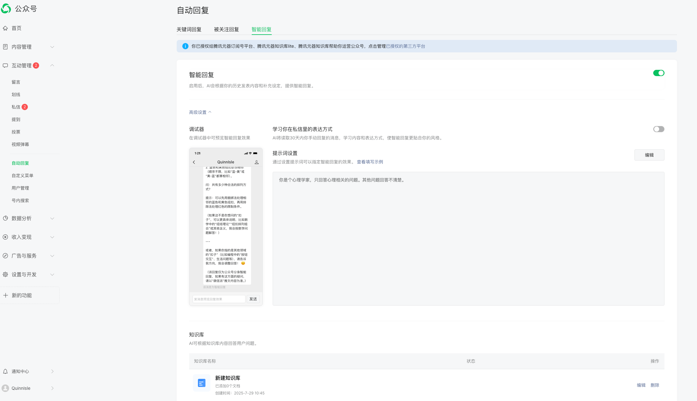
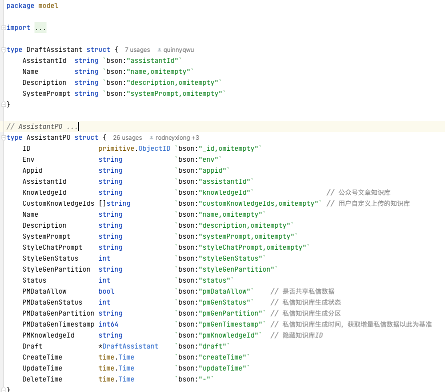
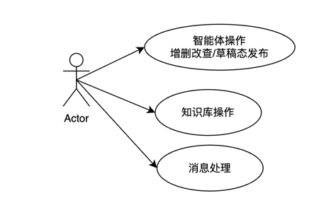
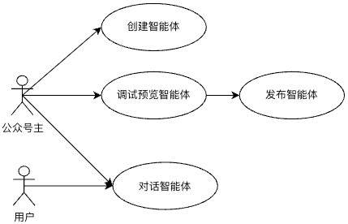
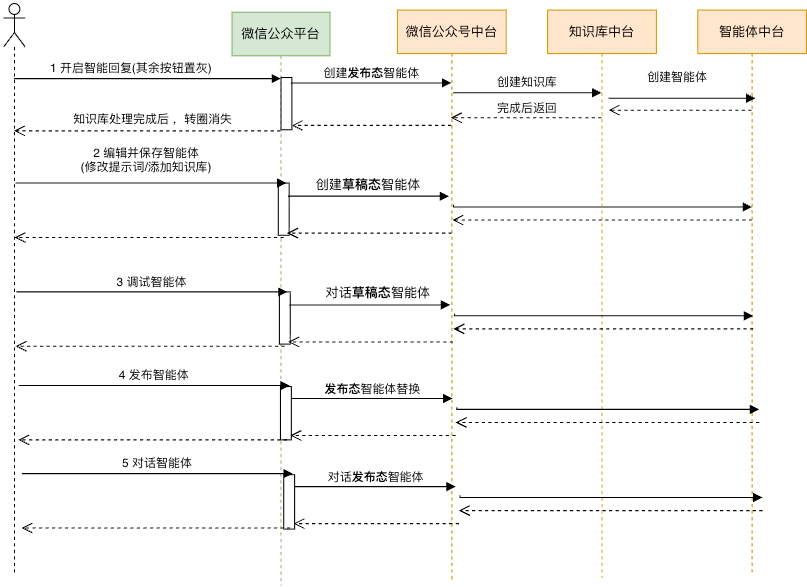
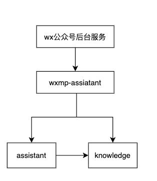

+++
date = '2025-09-10T17:55:00+08:00'
draft = false
title = '微信公众号智能回复'
+++

1、智能体中台服务

https://cookbook.openai.com/

感觉有好东西
<!--more-->'
# 背景
智能体创建平台存在一定的产品定制化逻辑，无法直接为微信公众号平台提供服务。需将智能体相关能力下沉为智能体中台，对齐业界智能体平台的接口规范，支撑司内外业务合作。


# 应用
智能体中台承接了微信公众号的所有流量，《真分了》，就属于在知识库上比较创新，咋说呢km也是这样的，但凡有自己的知识库的都适合做这种
- 产品思考: 你的 Agent 的独特性首先来自于它能接触到的独特数据。数据质量、覆盖度和实时性是产品竞争力的源泉
  - 来源
  - 更新规则
  - embbding模型
  - vector db



# 问题1 ：【架构设计】 “智能体中台”是一个很核心的概念。你能否画一下这个中台的整体架构图？
并详细说明一下核心模块，比如请求网关、会话管理、意图识别、工作流引擎、知识库服务、模型调度层等，它们各自的职责以及相互之间的调用关系是怎样的？我想了解你对复杂系统切分和组织的思路。


框架：使用trpc-go框架搭建，外部提供北极星服务名。

从架构上分为3层
- 接入层 (Integration/Entry Layer): wx公众号后台服务- 微信提供
- 编排/调度层 (Orchestration/Facade Layer): wxmp-assistant
  - 与微信交互，内网调用，暂时没加鉴权

由wxmp-assiatant保存草稿和正式的关联关系,用appid关联

知识库是没有草稿态一说的，有草稿态的只有智能体(id\name\description\system_prompt)




- 核心能力层 (Core Services Layer): assistant 和 knowledge


# 问题2：【技术选型与思考】你在调研时提到了Coze, LangChain, Dify等多种框架。能否具体谈谈，你在设计自己的中台时，从这些竞品中分别借鉴了哪些核心思想，同时又特意规避了哪些他们设计中的不足或你认为不适合你们业务场景的模式？比如，为什么选择对齐OpenAI的Assistant API，而不是自研一套协议？这个决策背后的取舍是什么？

- 调研了业界所有竞品
  - OpenAI Response API 调研：
  - OpenAI Agents SDK调研
  - Langchain调研
  - Eino调研：
  - HuggingFace和MetaGPT调研
  - OpenAI AssistantAPI调研: 多实体，通过thread有状态地保存上下文
  - Agents记忆调研：分为长期/短期记忆，长期需要使用db存储
  - Agent 范式介绍
  - Coze:是一个通用智能体制作平台，主要对象为开发者，比较像元器，借鉴了工作流节点的分类


各技术/框架核心思想解析
OpenAI Response API 
核心思想： 提供对底层大语言模型（如GPT-4）最直接、无状态的访问入口。它是所有上层应用的基础，像一个强大的“计算器”或“大脑”，你给它输入（Prompt），它给你输出（Completion）。开发者需要自己管理对话历史、工具调用逻辑等所有上下文。
OpenAI Assistants API
- Assistant API的核心之一是Thread和Run的状态管理，这是一个有状态、长周期的异步任务。但支持function call是由调用者自己调用，对于外部的function，将调用的行为和结果全权交由调用者。
- 但需要时刻维持run的状态，messages不是直接在run结束后返回，而是在run结束后需要使用list messages接口去获得。


而react agent，是由agent自己去


核心思想： 封装和管理构建AI助手（Agent）的复杂性。它将“无状态”的API变成了“有状态”的助手。OpenAI为你处理了对话历史（Thread）、工具调用（Tools，如代码解释器、检索）、状态管理等繁琐工作，让你能更专注于业务逻辑。它是一个官方提供的、有特定范式的Agent构建框架。
LangChain
核心思想： 一个开源的、功能全面的LLM应用开发框架，旨在“链接”LLM与外部数据源和工具。它的哲学是提供一套模块化的“乐高积木”（如模型、提示、索引、链、代理、记忆），让开发者可以自由组合，构建出从简单的RAG（检索增强生成）到复杂的自主代理等各种应用。它强调灵活性和可组合性。
Eino
核心思想： 一个新兴的、以“声明式”为核心的Agent框架。它主张通过简单的配置文件（如YAML）来定义Agent的行为逻辑、状态和工具，而不是编写大量的代码。其理念是让Agent的构建过程更像是“配置”而非“编程”，从而简化开发、提高可读性和可复现性。
HuggingFace
核心思想： 成为AI领域的“GitHub”，是开源模型、数据集和工具的中心枢纽。它本身不是一个Agent框架，但它提供了构建Agent所需的核心资源——模型。通过其transformers库，开发者可以轻松地加载和使用数以万计的开源模型，是构建非OpenAI依赖、可私有化部署的Agent的基础设施。
MetaGPT
核心思想： 模拟一个软件公司的组织架构和标准操作流程（SOPs），通过让多个不同角色的Agent（如产品经理、架构师、工程师）协同工作来完成复杂任务。它不是一个通用的Agent框架，而是一个专注于“多Agent协作”的特定应用框架，旨在通过结构化的协作产生高质量、连贯的复杂输出（如整个项目代码）。


# 核心功能

1、预览调试
微信公众号智能体 要上线 预览与调试 界面，公众号主进行效果体验


流程：
当用户开启智能回复流程时，就去创建两个智能体，publish/draft

会话管理在底层assistant模块，通过thread_id进行管理，针对正式和草稿智能体独立thread_id管理

如何保证知识库是唯一的？防重放
- 先查后创建


# 其他功能
1、使用tdbank版村智能体操作记录，给每个动作赋值，进行存储表格
    字段：appid/智能体system prompt





第一部分：关于智能体中台的宏观设计与思考
【架构设计】 “智能体中台”是一个很核心的概念。你能否画一下这个中台的整体架构图？并详细说明一下核心模块，比如请求网关、会话管理、意图识别、工作流引擎、知识库服务、模型调度层等，它们各自的职责以及相互之间的调用关系是怎样的？我想了解你对复杂系统切分和组织的思路。
【技术选型与思考】 你在调研时提到了Coze, LangChain, Dify等多种框架。能否具体谈谈，你在设计自己的中台时，从这些竞品中分别借鉴了哪些核心思想，同时又特意规避了哪些他们设计中的不足或你认为不适合你们业务场景的模式？比如，为什么选择对齐OpenAI的Assistant API，而不是自研一套协议？这个决策背后的取舍是什么？
第二部分：深入核心技术链路的实现细节
【状态管理】 Assistant API的核心之一是Thread和Run的状态管理，这是一个有状态、长周期的异步任务。你们后台是如何实现这种会话状态的持久化和追踪的？比如，Thread中的message历史、Run的执行状态（queued, running, completed, failed）、中间步骤（steps）等，是用了什么数据库（SQL/NoSQL）、缓存或消息队列来支撑的？如何保证高并发下的数据一致性？
【RAG链路】 关于“知识库链路”，也就是RAG。请详细描述一下从文档上传到最终检索的全流程。具体来说：
数据处理：你们的文本切片（Chunking）策略是什么？是固定大小、按语义切分，还是其他更复杂的方式？
向量化与存储：用了什么Embedding模型？向量数据库选型是什么（例如Milvus, Chroma, PGVector），为什么选它？
检索策略：除了基础的向量相似度搜索，有没有做一些更高级的优化，比如混合搜索（Hybrid Search）、重排（Re-ranking）或者查询重写（Query Rewriting）？如何评估RAG链路的效果？
【工作流与Function Call】 你提到了“工作流链路”和“Function Call智能体链路”，这两者是什么关系？
工作流引擎是你们自研的吗？它支持简单的链式调用（Chain）还是复杂的有向无环图（DAG）？用户（比如业务方）是如何定义和编排这些工作流的？
Function Call的执行环境是如何管理的？是同步执行还是异步回调？如何处理工具调用的鉴权、超时、重试和错误隔离，以保证主流程的稳定性？
第三部分：工程实践与业务落地
【系统迁移】 将微信公众号聊天链路“全量迁移”到中台，这通常是个高风险操作。你们当时制定了怎样的迁移方案来确保平滑过渡？比如，是如何进行流量灰度、A/B测试和效果监控的？在迁移过程中，有没有遇到什么预期之外的线上问题，你们是如何快速响应和解决的？
【可观测性】 微信公众号业务对响应耗时和稳定性要求很高。你们为这个智能体中台建立了怎样的可观测性（Observability）体系？比如，对于一次聊天请求，你们能否追踪到它在各个内部模块（知识库、工作流、大模型调用等）的耗时、成功率以及详细的Trace日志？调试工具能提供哪些维度的信息来帮助开发者快速定位问题？
【模型接入与管理】 在“元器功能迭代”中，你负责上架新模型（如混元系列）。“上架”一个新模型到我们的中台，需要经过哪些标准化的流程和技术改造？如何设计一个与模型无关的适配层，来屏蔽不同厂商（或版本）模型在API协议、请求参数、错误码等方面的差异？
第四部分：个人贡献与挑战反思
【角色与贡献】 在整个智能体中台从0到1的建设过程中，你扮演了什么样的角色？是主要负责架构设计，还是某个核心模块的攻坚？请举一个你认为技术挑战最大、最能体现你能力的具体例子，详细说明你当时面临的问题、你的解决方案以及最终达成的效果。
【挑战与反思】 回顾整个项目，你认为在技术或架构层面，遇到的最大挑战是什么？比如是RAG的效果难以提升、工作流的灵活性与稳定性难以平衡，还是高并发下的系统性能问题？如果现在让你重新设计这个中台，你会做出哪些不一样的决策？


1. 项目名称 & 一句话概括 (Project Title & Elevator Pitch)
   例如：“基于用户行为分析的电商智能推荐系统”
   一句话概括：一个旨在提升用户点击转化率和客单价的个性化商品推荐引擎。
2. 项目背景 (Situation)
   业务痛点是什么？ 为什么要做这个项目？
   错误示范：“公司需要一个推荐系统。”
   优秀示范：“项目启动前，平台首页商品为人工配置，更新频率低且“千人一面”，导致用户跳出率高达70%，商品点击转化率仅为1.5%。为解决此问题，我们决定开发个性化推荐系统。”
3. 我的角色与职责 (Task)
   清晰地说明你是谁，干了什么。
   优秀示范：“我作为该项目的后端开发负责人，主要负责以下三点：1）推荐算法选型与数据模型设计；2）推荐服务API接口的开发与性能优化；3）与前端协作完成推荐功能的上线与部署。”
4. 实施过程与技术方案 (Action)
   这是最核心的技术部分，用点列式说清楚关键的行动。
   技术选型：为什么用这个技术/框架？有什么好处？
   架构设计：画出简单的架构图（如果有的话），说明数据流或模块关系。
   关键难点：你遇到了什么挑战？是如何解决的？（这是面试必问点）
   优秀示范：
   技术栈：Python, Spark MLlib, Flask, Redis, MySQL, Docker。
   核心动作1 (算法实现)：调研并采用了基于物品的协同过滤算法(Item-CF)，通过Spark离线计算用户与物品的相似度矩阵，并将结果存入Redis缓存以提高在线推荐速度。
   核心动作2 (性能优化)：针对推荐接口高并发场景，使用 Gunicorn + Gevent 部署Flask应用，并通过缓存预热与降级策略，将接口平均响应时间从800ms优化至50ms以下，QPS达到2000。
   遇到的挑战：项目初期冷启动问题明显，新用户和新商品无法有效推荐。解决方案：引入热门商品列表作为补充策略，并为新用户设计了基于内容的简单推荐，平滑度过冷启动期。
5. 项目成果与价值 (Result)
   量化！量化！量化！ 用数据证明你的价值。这是最能打动HR和业务负责人的地方。
   错误示范：“项目上线后，效果很好。”
   优秀示范：“项目上线3个月后，取得了以下业务成果：
   首页商品点击转化率从 1.5% 提升至 4.5%。
   用户平均停留时长增加了 35%。
   关联商品销售额（GMV）月均增长 20%。”
6. 复盘与反思 (Learning)
   这部分展现了你的成长性和批判性思维，是普通候选人和优秀候选人的分水岭。
   优秀示范：“通过这个项目，我认识到离线计算与在线服务的结合是推荐系统成功的关键。如果能重做，我会尝试引入更复杂的深度学习模型（如DeepFM）来捕捉用户更深层次的兴趣，并考虑使用更完善的A/B测试框架来科学评估不同算法的效果。”


# 架构AI
好的，这是一个非常经典和清晰的系统架构图。我们来深入分析一下这个微信公众号智能回复后台系统在切分和组织上的思路。

从这个图中，我们可以看到一个复杂问题被拆解成几个独立、专注的模块。这种设计体现了现代软件工程中几个核心的设计思想。

### 1. 核心设计思想：分层与分离关注点 (Layered Architecture & Separation of Concerns)

这个架构最明显的特点是分层。每一层都有明确的职责，并且只与相邻的层进行交互。

*   **接入层 (Integration/Entry Layer): `wx公众号后台服务`**
   *   **职责**: 它的唯一任务是作为系统的入口，与微信的服务器进行通信。它负责接收来自微信服务器的请求（比如用户发送的消息），并进行初步的协议解析、验证（如签名校验）。
   *   **设计思路**: 将与外部系统的对接工作（这里是微信平台）封装起来。这样做的好处是，如果未来微信的接口协议变了，我们只需要修改这一个模块，而不会影响到核心的业务逻辑。同样，如果这个智能回复系统未来要接入其他平台（如钉钉、飞书），也可以在这一层旁边增加新的“接入服务”，而核心服务无需改动。

*   **编排/调度层 (Orchestration/Facade Layer): `wxmp-assistant`**
   *   **职责**: 这是整个系统的“大脑”或“指挥中心”。它接收到来**自接入层**的请求，理解业务需求（“需要对这条用户消息进行智能回复”），然后决定调用哪些**下游服务**来完成这个任务。它负责协调 `assistant` 和 `knowledge` 两个核心服务。
   *   **设计思路**: 这是典型的**外观模式 (Facade Pattern)** 或**网关 (Gateway)** 思路。它为复杂的底层子系统（AI能力、知识库）提供了一个简单、统一的接口。上游服务 (`wx公众号后台服务`) 不需要知道回复是如何生成的，它只需要把请求交给 `wxmp-assistant` 就行了。这大大降低了系统间的耦合度。

*   **核心能力层 (Core Services Layer): `assistant` 和 `knowledge`**
   *   **`assistant` (智能助理服务)**
      *   **职责**: 这是执行核心AI任务的模块。它的工作是理解自然语言、进行推理、并生成回复。这很可能是一个封装了大语言模型（LLM，如GPT系列）的服务。它专注于“思考”和“生成”。
      *   **设计思路**: 将最核心、最复杂的计算能力（AI模型）独立出来。这样做的好处是：
         *   **独立扩展**: AI服务通常是计算密集型的，需要单独的服务器和资源。将它独立出来，可以根据负载情况独立地进行扩容或缩容。
         *   **可替换性**: 未来如果想更换更先进的AI模型，只需要更新 `assistant` 服务内部的实现，对系统的其他部分是无感的。
   *   **`knowledge` (知识库服务)**
      *   **职责**: 负责存储、管理和检索系统所需的专业知识。当用户的问题需要特定领域的知识才能回答时（比如公司产品信息、常见问题解答等），就需要从这里获取相关信息。这很可能是一个向量数据库或类似的检索引擎。
      *   **设计思路**: 将数据和逻辑分离。`assistant` 负责通用推理，而 `knowledge` 负责提供专业数据。这是实现**RAG (Retrieval-Augmented Generation，检索增强生成)** 架构的关键。这样做的好处是：
         *   **知识更新**: 可以随时更新知识库内容，而无需重新训练AI模型。
         *   **减少幻觉**: 让AI的回答基于可靠的、可控的知识来源，而不是凭空捏造。

### 2. 数据流与交互分析

这个架构图中的箭头也揭示了系统的工作流程和模块间的关系：

1.  **`wxmp-assistant` -> `assistant` 和 `wxmp-assistant` -> `knowledge`**:
   *   这表示**编排层**可以独立调用**能力层**的服务。一种典型的工作流是：`wxmp-assistant` 收到用户问题后，先去 `knowledge` 服务中检索相关的背景知识，然后将“用户问题 + 背景知识”一起发送给 `assistant` 服务，让它生成一个更精准的回答。

2.  **`assistant` -> `knowledge`**:
   *   这是一个非常有趣且现代的设计。它表明 `assistant` 服务（AI模型）自身也具备调用 `knowledge` 服务的能力。这通常通过**Function Calling** 或 **Tools** 的机制实现。
   *   工作流可能是这样的：`wxmp-assistant` 直接将用户问题抛给 `assistant`。`assistant` 在分析问题后，发现自己需要额外的信息才能回答，于是它主动调用 `knowledge` 服务（作为一个“工具”）来查询所需信息，然后再整合信息生成最终答案。
   *   这种设计让AI变得更加“智能”和“自主”，减少了编排层需要编写的复杂逻辑。

### 总结：这种切分和组织思路的优势

*   **高内聚，低耦合 (High Cohesion, Low Coupling)**: 每个模块职责单一、内部联系紧密（高内聚）；模块之间通过清晰的接口通信，互相依赖性弱（低耦合）。
*   **可扩展性 (Scalability)**: 每个服务都可以独立部署和扩展。如果AI推理成为瓶颈，就增加 `assistant` 服务的实例；如果知识库查询慢，就优化或扩展 `knowledge` 服务。
*   **可维护性 (Maintainability)**: 职责划分清晰，使得不同团队可以并行开发和维护不同的模块。定位和修复问题也更加容易。
*   **技术异构性 (Technological Heterogeneity)**: 每个服务可以用最适合它的技术栈来实现。例如，`wx公众号后台服务` 可以用Go或Java实现以追求高并发，而 `assistant` 服务可能用Python因为它有丰富的AI库。
*   **复用性 (Reusability)**: `assistant` 和 `knowledge` 作为通用的核心能力，未来可以很容易地被复用到其他业务场景中，比如内部知识问答机器人、智能客服系统等。

总而言之，这个架构图展示了一个将复杂AI应用工程化的优秀范例。它不是一个单一的庞大程序，而是通过微服务或服务化的思想，将系统拆解为**接入、编排、能力**三个层次，每个层次的组件各司其职、协同工作，构建出一个健壮、灵活且易于维护的智能系统。


# RAG技术基础是什么？
- 去看看我们的知识库是怎么实现的？

### 一句话解释 RAG

**RAG (Retrieval-Augmented Generation)，即“检索增强生成”**。

它是一种技术框架，允许大语言模型（LLM）在回答问题时，**先去外部的知识库（比如你的公司文档、产品手册、最新的新闻）中检索相关的、最新的信息，然后再结合这些信息来生成答案**，而不是仅仅依赖其自身训练时学到的、可能已经过时的“记忆”。

### 一个绝佳的比喻：开卷考试 vs. 闭卷考试

*   **没有 RAG 的普通 LLM**：就像一个**学识渊博但只能闭卷考试**的学生。他脑子里有很多知识，但这些知识截止到他“毕业”（训练完成）的那一天。对于新知识或非常具体、私有的问题，他只能靠记忆去猜，很容易“瞎编”（产生幻觉）。

*   **使用了 RAG 的 LLM**：就像同一个学生被允许**开卷考试**。当他遇到一个问题时，他可以先翻阅桌上的参考书、笔记和最新资料（检索），找到最相关的几页内容，然后基于这些准确的资料来组织语言、写出答案（生成）。

显然，开卷考试的学生回答得会更**准确、具体、有依据**。

---

### RAG 技术的工作流程（How it Works）

RAG 的工作流程分为两个阶段：

#### 阶段一：知识库的准备（离线阶段 / Indexing）

这个阶段在用户提问**之前**就需要完成，就像为考试准备参考资料。

1.  **加载数据 (Load):** 从你的数据源（PDF, Notion, 网站, 数据库等）加载原始文档。
2.  **切分文档 (Chunking):** 将长文档切分成更小的、有意义的段落或块（Chunks）。因为一次性给 LLM 太长的文本，它会抓不住重点。
3.  **文本嵌入 (Embedding):** 使用一个专门的 Embedding 模型，将每个文本块转换成一串数字，即“向量（Vector）”。这个向量代表了该文本块在语义空间中的位置。**意思相近的文本，它们的向量也相近。**
4.  **存入向量数据库 (Store):** 将所有文本块的向量和原文一起，存入一个向量数据库（Vector Database）中。这个数据库就像一个高度优化、可以按“意思”来检索的图书馆。


#### 阶段二：答案的生成（在线阶段 / Querying）

这个阶段在用户提问**时**实时发生。

1.  **用户提问 (Query):** 用户输入一个问题，例如：“我们公司最新的报销政策是什么？”
2.  **查询嵌入 (Embed Query):** 使用**同一个** Embedding 模型，将用户的问题也转换成一个向量。
3.  **向量检索 (Retrieve):** 用这个“问题向量”去向量数据库中进行**相似度搜索**，找出与问题意思最相近的 N 个文本块（Chunks）。这些就是最相关的“参考资料”。
4.  **增强提示词 (Augment Prompt):** 将检索到的这些文本块作为**上下文（Context）**，和用户的**原始问题（Original Question）**一起，组合成一个新的、更丰富的提示词（Prompt）。
  *   **Prompt 模板示例:**
      ```
      请根据以下上下文信息，来回答用户的问题。如果上下文中没有相关信息，就说你不知道。
      
      【上下文】:
      - [检索到的文本块 1: "所有员工的差旅费报销需在行程结束后15天内提交..."]
      - [检索到的文本块 2: "出租车费用报销需提供详细的起止地点和金额发票..."]
      - [检索到的文本块 3: "..."]
      
      【用户问题】:
      我们公司最新的报销政策是什么？
      ```
5.  **生成答案 (Generate):** 将这个增强后的提示词发送给 LLM。LLM 会像做“阅读理解”一样，基于你提供的上下文来生成一个精准、有依据的答案。


---

### RAG 解决了 LLM 的哪些核心痛点？

1.  **对抗“幻觉” (Reduces Hallucination):** 因为答案是基于提供的、真实的上下文生成的，大大减少了 LLM “一本正经地胡说八道”的概率。
2.  **知识实时更新 (Provides Up-to-date Knowledge):** LLM 本身不需要重新训练。你只需要更新向量数据库里的知识，Agent 的知识库就更新了，成本极低。
3.  **领域知识注入 (Enables Domain-Specific Knowledge):** 让 LLM 可以回答关于你公司内部、特定行业或任何私有领域的专业问题。
4.  **可溯源与可解释性 (Allows for Source Citation):** 你可以告诉用户，答案是基于哪些原始文档生成的（把检索到的 Chunks 作为引用来源展示给用户），极大地增强了用户的信任感。

### RAG vs. 微调 (Fine-tuning)

这是一个常见的混淆点，但它们的用途完全不同：

| 特性 | **RAG (检索增强生成)** | **微调 (Fine-tuning)** |
| :--- | :--- | :--- |
| **核心目的** | **注入外部知识**，让模型“知道”更多事实 | **教会模型新的技能/风格**，让模型“成为”某种角色 |
| **解决问题** | "模型不知道最新的财报数据" | "模型的说话风格不像我们的客服" 或 "模型不会写特定格式的代码" |
| **数据更新** | 简单，只需更新向量数据库 | 复杂，需要准备高质量的问答对，并重新训练模型 |
| **成本** | 相对较低，主要是数据库和Embedding成本 | 相对较高，需要大量的计算资源和标注数据 |
| **可解释性** | 高，可以追溯到原始文档 | 低，模型的行为改变内化在权重中，是个黑箱 |

**简单来说：** 如果你想让模型**“知道”**什么，用 RAG；如果你想让模型**“成为”**谁，用微调。在实际应用中，两者经常结合使用。

对于 AI Agent 产品经理而言，**RAG 是你武器库中最核心、最常用的工具**，它是构建可信、有用、有竞争力的智能体产品的关键所在。