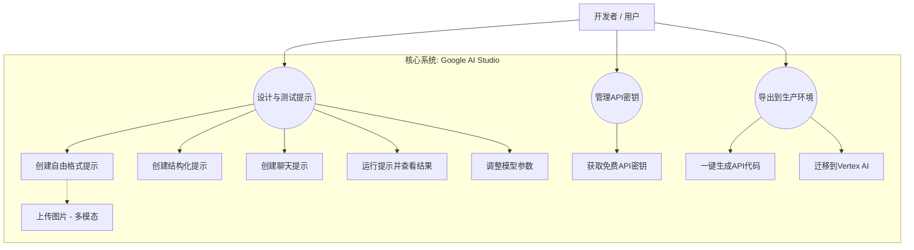

+++
date = '2025-06-18T14:50:33+08:00'
draft = false
title = 'x'
+++

https://aistudio.google.com/prompts/new_chat

<!--more-->

# 背景
Google AI Studio 是一个基于浏览器的免费在线工具，旨在帮助开发者快速、轻松地进行生成式 AI 模型的原型设计和实验。你可以把它想象成一个“AI 模型的在线实验室”或“创意沙盒”。它的核心是让你能够直接与 Google 最先进的 Gemini 系列模型 进行交互。
- 降低门槛： 在 AI Studio 出现之前，要测试一个大型语言模型（LLM），开发者通常需要配置复杂的开发环境、管理 API 密钥、编写不少的样板代码。AI Studio 将这一切简化，用户只需打开浏览器就能开始。
- 推广 Gemini 生态： Google 希望吸引更多开发者使用其强大的 Gemini 模型。提供一个免费、易用的工具是展示模型能力、建立开发者生态的最佳方式。它直接对标 OpenAI 的 Playground。
- 加速原型验证： 许多 AI 应用的成功与否取决于“提示工程”（Prompt Engineering）。AI Studio 提供了一个理想的环境，让开发者可以快速迭代、测试和优化他们的提示（Prompt），从而验证一个想法是否可行，然后再投入实际的编码工作。
- 连接生产环境： AI Studio 不仅仅是一个玩具。当你在其中调试好一个满意的原型后，可以一键生成 Python、Node.js、Go 等多种语言的 API 调用代码，无缝地将原型集成到你的应用程序中。它也是通往更强大的企业级平台 Vertex AI 的桥梁。

# 用例图

# 静态建模
# 系统架构
# 时序图
# 状态机
# 对外API

