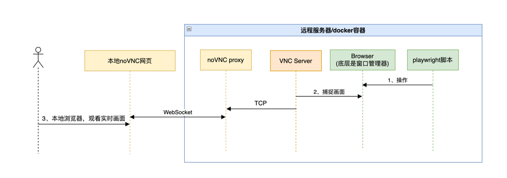

+++
date = '2025-07-11T10:58:00+08:00'
draft = false
title = '如何快速搭建Browser Use？'
+++
本文介绍了browser Use的定义， 展示参考manus行为的demo搭建的过程
- 当前使用playwright操作浏览器
<!--more-->

# 背景
作为Deep Research三大工具之一,另两个是Code和Search

# 原理
要让 AI Agent 完成任务，可以直接让 AI 浏览网页，像人一样去理解页面。
核心原理：观察-思考-行动（Observation-Thought-Action, OTA）循环，所有智能体的浏览器操作都可以归结为一个持续循环的框架，这与强化学习中的智能体与环境交互的模式非常相似。
- 观察 (Observation-O): 智能体需要“看到”并“理解”当前浏览器的界面。这是输入环节。
- 思考 (Thought-T): 基于当前的观察结果和最终的总任务目标，智能体（其核心是LLM）进行推理和规划，决定下一步应该做什么。这是决策环节。
- 行动 (Action-A): 智能体执行上一步决策出的具体操作，例如点击按钮、输入文字、滚动页面等。这是输出环节。

# 业界调研
主流程：理解任务 -> 制定计划 -> 浏览网页 -> 观察和理解内容 -> 提取信息 -> 综合分析 -> 得出结论
## Manus


# 技术方案
## 流程图


# DockerFile

```bash
# 1. 使用更优的 node:slim 基础镜像
FROM node:22-bookworm-slim

# 2. 环境变量
ENV PW_VERSION=1.44.0
ENV DEBIAN_FRONTEND=noninteractive

# -- 用户和路径配置 --
ENV APP_USER=pwuser
ENV APP_HOME=/home/${APP_USER}

# -- VNC 和 Web VNC 配置 --
ENV VNC_RESOLUTION=1280x720
ENV NOVNC_PORT=6901
# 【变化】移除了 VNC_PASSWORD 环境变量，因为它不再被使用

# -- Playwright 服务配置 --
ENV PW_PORT=3000
ENV PW_BROWSER="chromium"
ENV PW_HEADLESS="false"

# 3. 精细的镜像瘦身
RUN echo 'path-exclude /usr/share/doc/*' > /etc/dpkg/dpkg.cfg.d/01_nodoc && \
    echo 'path-exclude /usr/share/man/*' >> /etc/dpkg/dpkg.cfg.d/01_nodoc

# 4. 创建用户
RUN useradd --create-home --shell /bin/bash --uid 1001 ${APP_USER}

# 5. 安装系统依赖
USER root
RUN apt-get update && \
    apt-get install -y --no-install-recommends \
    supervisor \
    # 【变化】移除了 tigervnc-common，因为它只包含不再需要的 vncpasswd
    tigervnc-standalone-server \
    novnc websockify \
    fluxbox xterm fonts-liberation \
    wget ca-certificates \
    && \
    echo "===== Installing Google Chrome Stable =====" && \
    wget -q -O /tmp/chrome.deb "https://dl.google.com/linux/direct/google-chrome-stable_current_amd64.deb" && \
    apt-get install -y /tmp/chrome.deb && \
    npm config set cache /tmp/npm_cache_root --global && \
    npx --yes playwright@${PW_VERSION} install-deps && \
    apt-get autoremove -y && \
    apt-get clean && \
    rm -rf /var/lib/apt/lists/* /var/cache/apt/* /tmp/* /var/tmp/* /root/.npm

# 6. 复制所有配置文件和脚本
COPY supervisord.conf /etc/supervisor/conf.d/supervisord.conf
COPY start-playwright-server.js ${APP_HOME}/start-playwright-server.js
# 【变化】移除了所有与 entrypoint.sh 相关的行
RUN chown ${APP_USER}:${APP_USER} ${APP_HOME}/start-playwright-server.js

# 7. 以非 root 用户身份安装项目级的 Playwright
USER ${APP_USER}
WORKDIR ${APP_HOME}
RUN npm install playwright@${PW_VERSION} && \
    npx playwright install && \
    rm -rf /tmp/* ~/.npm
# 切换回 root 用户来运行进程管理器
USER root
# 8. 暴露端口，并设置默认命令
EXPOSE ${NOVNC_PORT}
EXPOSE ${PW_PORT}
# 【变化】移除了 ENTRYPOINT，CMD 现在直接启动 supervisord
CMD ["/usr/bin/supervisord", "-c", "/etc/supervisor/conf.d/supervisord.conf"]
```


