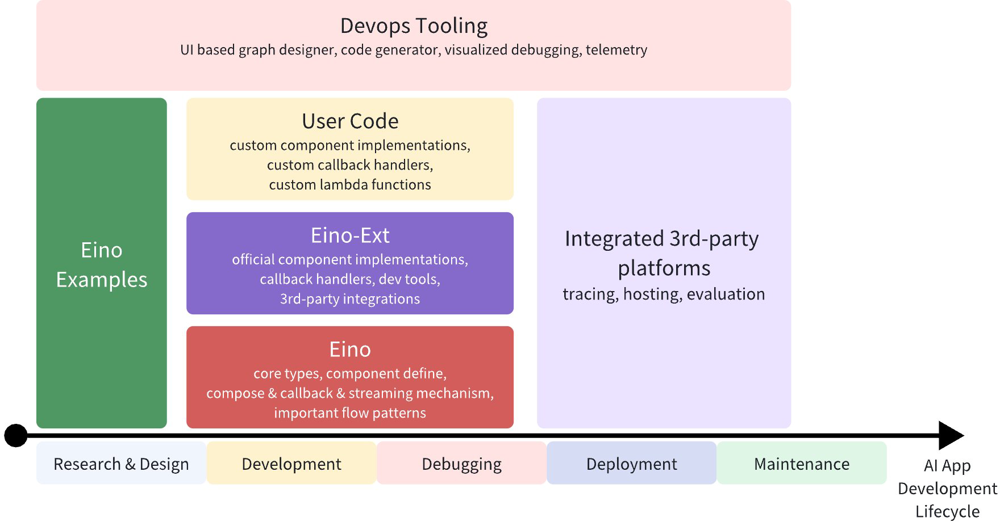

+++
date = '2025-07-15T10:58:00+08:00'
draft = false
title = 'Eino介绍'
+++
本文详细介绍了Eino的系统架构、用例图、静态建模、状态机、时序图、对外API，可以系统了解Eino设计思想及原理
https://www.cloudwego.io/zh/docs/eino/overview/eino_open_source/

<!--more-->

# 背景

字节跳动，基于Golang的大模型应用综合开发框架
- 覆盖开发、测试、运维全流程
- 提供大量组建使用

# 架构

# 用例图

# 静态建模

# 状态机

# 时序图

