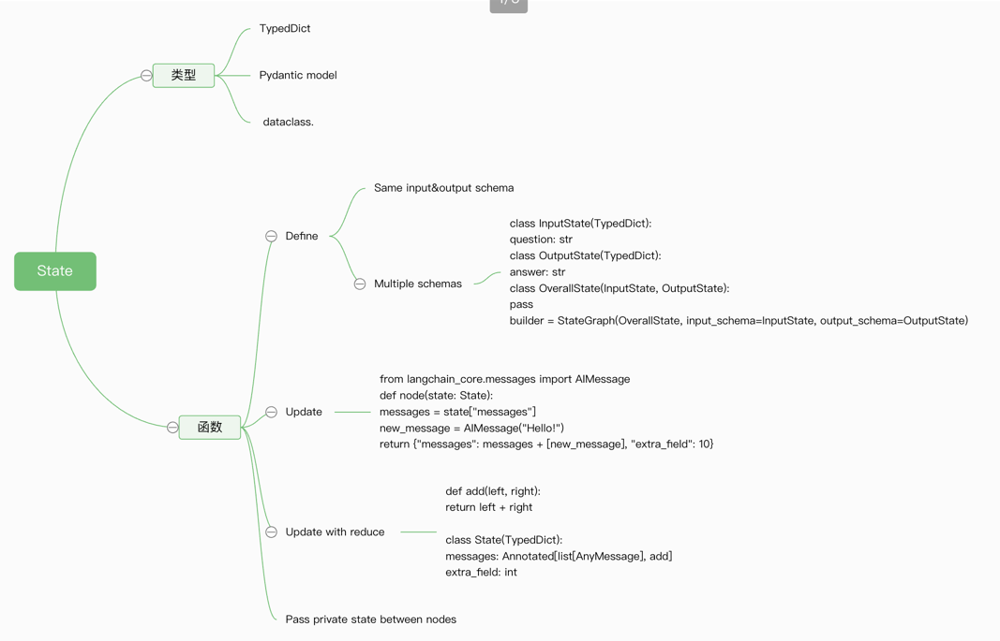
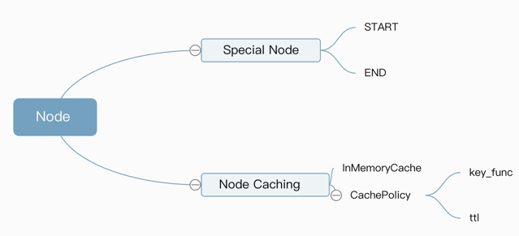
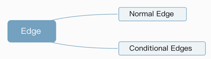

+++
date = '2025-08-04T16:58:00+08:00'
draft = false
title = 'LangGraph'
+++
本文详细介绍了LangGraph的主要技术
https://www.cloudwego.io/zh/docs/eino/overview/eino_open_source/

<!--more-->

核心哲学：图 = 状态 + 节点 + 边
所有 Agent 工作流都被建模为“图”（Graph），而图由三个核心组件构成：

1.状态 (State):
- 是什么： 一个共享的数据结构，代表了你的应用在任意时刻的快照。可以把它想象成一个所有节点都能读写的中央白板。
- 为什么重要： 这是数据在整个图中流动和演变的载体。所有节点的输入都来自这个状态，所有节点的输出都是对这个状态的更新。


1.1 状态模式 (Schema)
    你必须为状态定义一个结构。最推荐的方式是使用 TypedDict，但同样支持 Pydantic BaseModel（提供运行时验证，但性能稍低）和 dataclass（提供默认值）。
- 多模式 (Multiple Schemas): 这是一个高级但强大的功能。一个图可以有不同的输入、输出和内部状态模式。
- 输入/输出模式：可以限制用户调用图时只能传入或看到部分状态字段。
- 私有状态：节点之间可以传递一些“内部沟通”用的数据，而这些数据对外部是不可见的。
1.2 Reduce - 状态更新的核心机制
- 是什么： Reducer 是一个函数，它定义了如何将一个节点返回的更新应用到主状态的特定字段上。状态中的每个字段（key）都可以有自己的 Reducer。
- 默认 Reducer： 如果你不指定，默认的 Reducer 就是“覆盖”。例如，如果当前状态是 {"foo": 1, "bar": ["a"]}，一个节点返回 {"foo": 2}，那么新状态就是 {"foo": 2, "bar": ["a"]}。foo 的值被直接覆盖了。
- 自定义 Reducer (Annotated)： 这才是强大的地方。通过 typing.Annotated，你可以为某个字段指定一个不同的更新函数。最经典的例子是对话历史：
```python
from typing import Annotated
from operator import add

class State(TypedDict):
    # foo 字段使用默认的覆盖逻辑
    foo: int
    # bar 字段使用 operator.add 作为 reducer
    bar: Annotated[list[str], add] 
```


2.节点 (Nodes):
- 是什么： 执行具体任务的 Python 函数。它们是图中的“工作人员”。
- 为什么重要： 节点是真正干活的地方。一个节点接收当前的状态，执行计算（比如调用 LLM、访问数据库、运行代码），然后返回一个状态更新包。

节点是接收图状态（state）作为输入的 Python 函数（同步或异步）。除了 state，它还可以选择性地接收 config 和 runtime 两个参数：
config: 一个 RunnableConfig 对象，包含了线程ID（thread_id）、标签（tags）等可配置的运行时信息
runtime: 一个 Runtime 对象，包含了传递给图的运行时上下文信息，例如数据库连接、模型名称等

1.Node Caching节点缓存

核心思想是避免重复执行昂贵的计算
编译图时指定一个缓存实例 cache=InMemoryCache()
精确地告诉 LangGraph 哪些节点应该被缓存，以及如何缓存 cache_policy=CachePolicy(ttl=3)
- key_func：决定了“什么算作相同的输入”。默认行为通常足够好。当节点被调用时，LangGraph 会运行 key_func，将节点的输入数据作为参数。LangGraph 会用这个键去缓存系统中查找是否存在已存的结果
  - 默认行为：如果你不提供自己的 key_func，LangGraph 会使用 pickle 库将整个输入对象序列化，然后计算其哈希值。这意味着，只有当两次调用的输入数据一模一样时，生成的键才会相同，缓存才会命中。
  - 何时自定义：在某些高级场景下，你可能只想根据输入的一部分来创建缓存键
- ttl：决定了结果的“保鲜期”。对于会变化的数据源，设置一个合理的 ttl 至关重要

```python
import time
from typing_extensions import TypedDict
from langgraph.graph import StateGraph
from langgraph.cache.memory import InMemoryCache
from langgraph.types import CachePolicy


class State(TypedDict):
    x: int
    result: int


builder = StateGraph(State)


def expensive_node(state: State) -> dict[str, int]:
    # expensive computation
    time.sleep(2)
    return {"result": state["x"] * 2}


builder.add_node("expensive_node", expensive_node, cache_policy=CachePolicy(ttl=3))
builder.set_entry_point("expensive_node")
builder.set_finish_point("expensive_node")

graph = builder.compile(cache=InMemoryCache())

print(graph.invoke({"x": 5}, stream_mode='updates'))  
[{'expensive_node': {'result': 10}}]
print(graph.invoke({"x": 5}, stream_mode='updates'))  
[{'expensive_node': {'result': 10}, '__metadata__': {'cached': True}}]
```

3.边 (Edges):
- 是什么： 连接节点的路径，决定了工作流的方向。它们是图中的“流程控制器”或“路由规则”。
- 为什么重要： 边决定了在一个节点完成后，接下来应该执行哪个节点。这可以是固定的路径（A 总是到 B），也可以是根据当前状态动态判断的条件路径（如果状态满足 X，则去 B；否则去 C）。



3.1 Conditional Edges

```python
graph.add_conditional_edges("node_a", routing_function)
graph.add_conditional_edges("node_a", routing_function, {"key1": "node_b", "key2": "node_c"})
```


